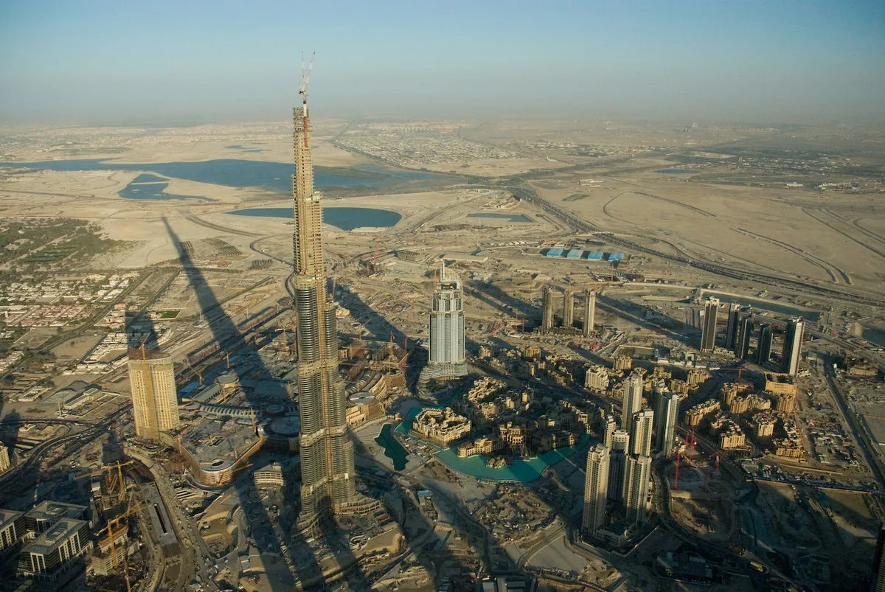
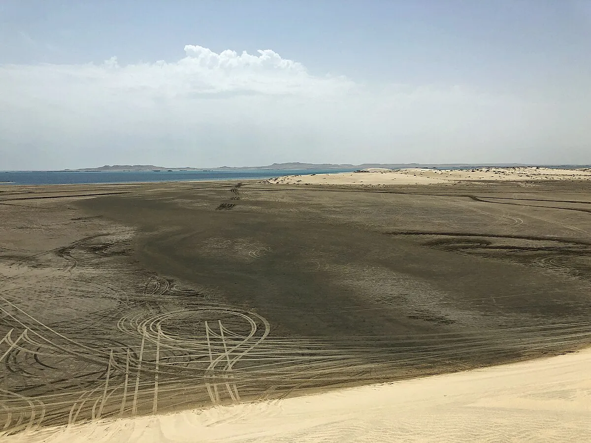

# Trip 1: Dubai to Delhi

- **📅 Dates:** February 1 – May 26, 2027
- **⏱️ Duration:** 115 days (40 driving days)
- **🚗 Distance:** 10,780 km driving
- **🌍 Countries:** 10 (UAE, Oman, Qatar, Bahrain, Saudi Arabia, Kuwait, Iraq, Iran, Pakistan, India)
- **⏰ Driving:** 141 hours total
- **🛣️ Driving days:** 40 days (>1hr drive)
- **🏖️ Chilling days:** 74 days
- **🚢 Shipping:** Bandar Abbas → Karachi (3-5 days)

---

## Route Overview

> **Gulf States & Iraq**
> Dubai → Oman Coast → Empty Quarter → Abu Dhabi → Qatar → Bahrain → Saudi Arabia (Riyadh) → Kuwait → Iraq (Ziggurat of Ur)

> **Iran**
> Tehran → Isfahan → Yazd → Shiraz → Persepolis → Bandar Abbas

> **🚢 Ship:** Bandar Abbas → Karachi (3-5 days)

> **Pakistan & India**
> Karachi → Lahore → Islamabad → Karakoram Highway → Hunza Valley → Khunjerab Pass → [return] → India via Wagah → Amritsar → Manali-Leh → Delhi

---

# Detailed Itinerary

## Week 1: UAE & Oman Coast

### Day 1: Dubai — *February 1, 2027*
**Rest day - Pick up vehicle**

| | |
|---|---|
| **Driving** | 0 km |
| **Stay** | Hotel - Dubai Marina |

- Morning: Pick up Land Cruiser from build shop, final inspection
- Afternoon: Test drive, pack vehicle
- Evening: Burj Khalifa sunset, farewell dinner

Dubai serves as the expedition's starting point, chosen for its established 4x4 customization industry and position at the gateway to the Arabian Peninsula. The city's modern infrastructure makes it ideal for final vehicle preparation and provisioning before heading into more remote regions.

Final vehicle inspection and handover from the build shop, followed by a test drive to verify all modifications. Evening at Burj Khalifa for sunset views over the city. February temperatures average 18-26°C with minimal chance of rain - ideal conditions for the journey's start.

---

### Day 2: Dubai → Khor Fakkan — *February 2, 2027*
**Scenic coastal drive**

| | |
|---|---|
| **Distance** | 131 km |
| **Driving** | 1.5 hrs |
| **Stay** | Hotel - Khor Fakkan |

- Morning: Depart Dubai, drive through Sharjah
- Scenic: Hajar Mountains views begin
- Evening: Khor Fakkan beach, first camp preparations check

Khor Fakkan is a natural deep-water port on the Gulf of Oman, separated from the rest of the UAE by the Hajar Mountains. It's one of the oldest settlements in the region, with archaeological evidence of habitation dating back 4,000 years. The town belongs to Sharjah emirate despite being geographically isolated from it.

Short driving day through Sharjah and across the Hajar Mountain pass. The coast road offers first views of the dramatic mountain scenery that continues into Oman. Evening on the beach to test camping gear before the first wild camp. February coastal temperatures around 20-28°C, sea temperature suitable for swimming.

---

### Day 3: Khor Fakkan → Musandam Fjords — *February 3, 2027*
**Mountain & fjord scenery**

| | |
|---|---|
| **Distance** | 200 km |
| **Driving** | 3.5 hrs |
| **Border** | UAE → Oman (Musandam exclave) |
| **Stay** | Wild camp - Musandam |

- Morning: Coast road to Dibba
- Border: Quick crossing into Oman's Musandam peninsula
- Afternoon: Khasab, dhow cruise through fjords
- Evening: Wild camp with fjord views

The Musandam Peninsula is an Omani exclave separated from the rest of the country by UAE territory. The coastline is often called the "Norway of Arabia" - steep limestone cliffs plunge directly into the Strait of Hormuz, creating a series of narrow fjords (khors) that extend kilometers inland. Dolphins are common in these waters, and the area sees significant tanker traffic transiting the strait.

Drive north along the coast to Dibba, then cross into Oman at the Musandam border. Afternoon dhow cruise through Khor ash-Sham, the largest fjord, watching for dolphins. First wild camp of the trip on a gravel beach with fjord views. February brings calm seas and clear skies, temperatures 18-25°C.

---

### Day 4: Musandam → Sohar — *February 4, 2027*
**Coastal transit**

| | |
|---|---|
| **Distance** | 350 km |
| **Driving** | 4.5 hrs |
| **Border** | Oman → UAE → Oman |
| **Stay** | Hotel - Sohar |

- Full day drive along coast
- Re-enter UAE briefly, then back to Oman mainland
- Evening: Sohar old town, fish market

Sohar was once one of the most important ports in the Islamic world, controlling trade routes between the Gulf and East Africa. Legend holds it as the birthplace of Sinbad the Sailor. The city declined after the Portuguese arrived in the 16th century but has recently grown as an industrial port. The old souq and fish market retain traditional character.

Longer driving day south from Musandam, exiting Oman into UAE and re-entering Oman proper at the mainland border. The route follows the Gulf of Oman coastline through a string of fishing villages. Evening walk through Sohar's old quarter and fish market where the day's catch is auctioned. Temperatures 20-28°C, dry and clear.

---

### Day 5: Sohar → Muscat — *February 5, 2027*
**Capital arrival**

| | |
|---|---|
| **Distance** | 230 km |
| **Driving** | 2.5 hrs |
| **Stay** | Hotel - Muscat |

- Morning: Drive to Muscat
- Afternoon: Sultan Qaboos Grand Mosque (stunning!)
- Evening: Muttrah Souq, corniche walk

Muscat has been Oman's capital since the 1790s, though the area has been inhabited for at least 6,000 years. The city is constrained by mountains and spreads along the coast in a series of distinct districts. Unlike other Gulf capitals, Muscat has strict building codes limiting height and requiring traditional architectural elements, giving it a cohesive low-rise appearance.

Morning drive along the coast highway to Muscat. Afternoon visit to Sultan Qaboos Grand Mosque - completed in 2001, it holds the world's second-largest hand-woven carpet (4,343 square meters). Evening at Muttrah Souq, one of the oldest markets in the Arab world, followed by a walk along the corniche. February weather ideal: 20-27°C, sunny.

---

### Day 6: Muscat — *February 6, 2027*
**Rest day**

| | |
|---|---|
| **Driving** | 0 km |
| **Stay** | Hotel - Muscat |

- Morning: Royal Opera House area
- Afternoon: Old Muscat, Al Alam Palace
- Evening: Seafood dinner at the port

Old Muscat occupies a natural harbor surrounded by mountains, fortified since the Portuguese built Forts Jalali and Mirani in the 1580s. The area remained the country's administrative center until Sultan Qaboos moved government functions to newer districts. Al Alam Palace, the Sultan's ceremonial residence, sits between the two forts along the waterfront.

Full rest day to explore Muscat. Morning at the Royal Opera House district - the opera house itself opened in 2011 and is one of the finest in the Middle East. Afternoon in Old Muscat to see Al Alam Palace and the Portuguese forts from outside. Evening seafood dinner at the fishing port. Temperatures 20-27°C, calm conditions.

---

### Day 7: Muscat → Wadi Shab — *February 7, 2027*
**Wadi adventure**

| | |
|---|---|
| **Distance** | 166 km |
| **Driving** | 2 hrs |
| **Stay** | Camp - Wadi Shab area |

- Morning: Depart Muscat on coastal road
- Afternoon: Wadi Shab hike - swim through canyon to waterfall
- Evening: Camp near wadi

Wadi Shab ("gorge between cliffs" in Arabic) cuts through the Eastern Hajar Mountains to the sea. The lower section contains permanent pools fed by springs, creating an oasis of date palms and emerald water in an otherwise barren landscape. The wadi terminates in a cave with a waterfall that can only be reached by swimming through narrow channels.

Short morning drive south along the coast highway. The hike into Wadi Shab begins with a boat crossing, then follows the canyon upstream for about 45 minutes. The final section requires swimming through rock channels to reach the cave waterfall - bring dry bags for cameras. Wild camp near the wadi entrance. February temperatures around 22-28°C; water is refreshing but not cold.

---

## Week 2: Oman Interior

### Day 8: Wadi Shab → Nizwa — *February 8, 2027*
**Into the mountains**

| | |
|---|---|
| **Distance** | 180 km |
| **Driving** | 2.5 hrs |
| **Stay** | Hotel - Nizwa |

- Morning: Continue coast road, then turn inland
- Afternoon: Nizwa Fort, souq (famous for silver)
- Evening: Traditional Omani dinner

Nizwa was Oman's capital in the 6th and 7th centuries and remains the country's spiritual heartland. The massive 17th-century fort dominates the old town, its circular tower 30 meters in diameter and 36 meters tall. The adjacent souq is one of the most traditional in Oman, particularly known for silverwork, pottery, and the Friday livestock market.

Drive inland from the coast, climbing through the Hajar Mountains to Nizwa at 500m elevation. Afternoon exploring the fort and souq - the Nizwa souq is less touristy than Muttrah and offers better prices on Omani silver. Traditional dinner of shuwa (slow-cooked lamb) if available. Temperatures cooler than the coast: 15-25°C.

---

### Day 9: Nizwa → Jebel Akhdar — *February 9, 2027*
**Green Mountain**

| | |
|---|---|
| **Distance** | 72 km |
| **Driving** | 1.5 hrs (4WD required) |
| **Stay** | Hotel - Jebel Akhdar |

- Morning: Drive up Jebel Akhdar (2,000m elevation)
- Afternoon: Rose gardens, terraced villages
- Evening: Mountain sunset, cool temperatures

Jebel Akhdar ("Green Mountain") rises to 2,980m in the Western Hajar range. The plateau receives more rainfall than the rest of Oman, supporting terraced agriculture of pomegranates, walnuts, and Damask roses. The rose harvest in March-April produces rose water used throughout the Gulf. Villages here have been continuously inhabited for over 4,000 years.

The road to Jebel Akhdar is restricted to 4WD vehicles - police check at the base. The ascent winds through dramatic gorges before reaching the plateau at 2,000m. Afternoon walking through terraced villages and rose gardens. Temperatures significantly cooler at altitude: 8-18°C in February, cold at night. Bring layers.

---

### Day 10: Jebel Akhdar → Jebel Shams — *February 10, 2027*
**Oman's Grand Canyon**

| | |
|---|---|
| **Distance** | 120 km |
| **Driving** | 3 hrs (rough mountain roads) |
| **Stay** | Camp - Jebel Shams rim |

- Morning: Descend Jebel Akhdar, drive through Wadi Bani Awf
- Afternoon: Ascend Jebel Shams (3,009m - Oman's highest)
- Evening: Camp at canyon rim, incredible star gazing

Jebel Shams is Oman's highest peak at 3,009m. The mountain's main attraction is Wadi Ghul, a 1,000-meter deep canyon often compared to the Grand Canyon. The canyon walls reveal 500 million years of geological history in exposed limestone layers. An abandoned village clings to a ledge partway down - reportedly abandoned when the last permanent resident died in the 1990s.

Challenging driving day on rough mountain roads. Descend Jebel Akhdar and drive through Wadi Bani Awf - one of Oman's most scenic mountain routes. The final ascent to Jebel Shams is steep and rocky. Camp at the canyon rim for sunset and stargazing - minimal light pollution at this elevation. February nights cold: temperatures can drop to 0-5°C. Days pleasant at 12-18°C.

---

### Day 11: Jebel Shams — *February 11, 2027*
**Rest day - Canyon exploration**

| | |
|---|---|
| **Driving** | 0 km |
| **Stay** | Camp - Jebel Shams |

- Morning: Balcony Walk hike along canyon edge
- Afternoon: Relax, photography
- Evening: Sunset over the canyon

The Balcony Walk is a 4km trail carved into the cliff face 200m below the rim, leading to the abandoned village of As Sab. The path was the only access to the village before it was abandoned. Petroglyphs along the route suggest the trail has been in use for thousands of years. The views into the canyon are vertigo-inducing.

Morning hike on the Balcony Walk - allow 3-4 hours round trip. The trail is exposed but not technically difficult; sturdy footwear essential. Afternoon for photography and relaxation. Second night camping at the rim. Temperatures similar to previous day; clear skies typical for February.

---

### Day 12-13: Jebel Shams → Salalah — *February 12-13, 2027*
**Long drive south (2 days)**

| | |
|---|---|
| **Distance** | 970 km total |
| **Driving** | 6-7 hrs per day |
| **Stay** | Day 12: Roadside camp / Day 13: Hotel Salalah |

- Day 12: Descend mountains, drive south on Highway 31
- Overnight: Wild camp in desert
- Day 13: Continue to Salalah, afternoon arrival
- Salalah: Green and tropical (monsoon region)

The drive to Salalah crosses some of Oman's most remote territory - 900km of desert highway with only a few service stations. The landscape transitions from mountain to gravel desert to sand dunes as the road approaches Dhofar region. Salalah itself is geographically and culturally distinct from northern Oman, receiving monsoon rains from June to September that turn the hills green.

Two long driving days on Highway 31. Day 12: Descend from Jebel Shams and drive south through increasingly arid terrain. Wild camp off the highway - flat gravel desert with no facilities. Day 13: Continue south, arriving Salalah mid-afternoon. Temperatures increase as elevation drops; expect 25-32°C in Salalah during February. Dry season - the monsoon greenery will have faded.

---

### Day 14: Salalah — *February 14, 2027*
**Rest day - Dhofar region**

| | |
|---|---|
| **Driving** | Day trips only |
| **Stay** | Hotel - Salalah |

- Morning: Frankincense museum, Al Baleed ruins
- Afternoon: Mughsail Beach blowholes
- Evening: Coconut palms, feels like different country

Salalah was the center of the ancient frankincense trade - the aromatic resin was harvested from trees in the nearby mountains and shipped across the ancient world from ports along this coast. Al Baleed was one of these ports, now a UNESCO World Heritage Site. The city was also the birthplace of Sultan Qaboos, who transformed Oman from an isolated medieval state into a modern nation.

Rest day exploring Dhofar. Morning at the Land of Frankincense museum and Al Baleed archaeological site. Afternoon drive to Mughsail Beach to see the blowholes - sea caves that shoot water skyward when waves hit. The Dhofar region has a distinctly different feel from northern Oman: coconut palms, cattle grazing, and a population with cultural ties to Yemen and East Africa. Temperatures 25-32°C, humid.

---

## Week 3: Empty Quarter & UAE Return

### Day 15-16: Salalah → Empty Quarter — *February 15-16, 2027*
**Into the Rub' al Khali**

| | |
|---|---|
| **Distance** | 600 km |
| **Driving** | 7 hrs |
| **Border** | Oman → UAE |
| **Stay** | Desert camp - Empty Quarter |

- Day 15: Drive north through Dhofar, enter Empty Quarter
- Massive sand dunes, endless desert
- Day 16: Rest day, dune exploration, sandboarding

The Rub' al Khali (Empty Quarter) is the world's largest contiguous sand desert, covering 650,000 square kilometers across Oman, UAE, Saudi Arabia, and Yemen. Sand dunes here reach heights of 250 meters. The desert was first crossed by a Westerner in 1931 when Bertram Thomas walked from Salalah to Qatar; Wilfred Thesiger made two crossings in the late 1940s, both starting from Salalah.

Day 15: Long driving day north from Salalah into the desert, crossing into UAE. The road is paved but remote; carry extra fuel and water. Day 16: Rest day at a desert camp - dune driving, sandboarding, and camel encounters. February is ideal for desert travel: daytime temperatures 22-30°C, nights cool at 12-18°C, no rain.

---

### Day 17: Empty Quarter → Liwa — *February 17, 2027*
**UAE desert**

| | |
|---|---|
| **Distance** | 300 km |
| **Driving** | 4 hrs |
| **Stay** | Camp - Liwa Oasis |

- Cross into UAE
- Liwa Oasis - edge of Empty Quarter
- Moreeb Dune - one of world's tallest

Liwa Oasis is a crescent of date palm settlements on the northern edge of the Empty Quarter. The oasis has been inhabited for at least 4,000 years and is the ancestral home of the ruling Al Nahyan family of Abu Dhabi. Moreeb Dune (Tal Moreeb) rises 300 meters - one of the tallest sand dunes in the world, and the site of annual hill-climb competitions.

Drive northwest through the Empty Quarter to Liwa. The landscape transitions from endless dunes to the irrigated palm groves of the oasis. Afternoon visit to Moreeb Dune - the climb to the top is strenuous in soft sand but the view is extraordinary. Wild camp in the desert. Temperatures 22-30°C, clear skies.

---

### Day 18: Liwa → Abu Dhabi — *February 18, 2027*
**Capital city**

| | |
|---|---|
| **Distance** | 155 km |
| **Driving** | 1.5 hrs |
| **Stay** | Hotel - Abu Dhabi |

- Morning: Drive to Abu Dhabi
- Afternoon: Sheikh Zayed Grand Mosque (spectacular!)
- Evening: Corniche walk, Emirates Palace

Abu Dhabi is the largest and wealthiest of the seven UAE emirates, holding 90% of the country's oil reserves. The city was a small fishing village until oil exports began in 1962. The Sheikh Zayed Grand Mosque, completed in 2007, is one of the world's largest mosques - it holds 40,000 worshippers and features 82 domes, 1,000 columns, and the world's largest hand-knotted carpet.

Short morning drive from Liwa to Abu Dhabi. Afternoon at Sheikh Zayed Grand Mosque - allow 2-3 hours; modest dress required (abayas provided for women). Evening walk along the Corniche and dinner near Emirates Palace. February weather excellent: 20-27°C, sunny, low humidity.

---

### Day 19: Abu Dhabi → Inland Sea (Qatar) — *February 19, 2027*
**Into Qatar**

| | |
|---|---|
| **Distance** | 400 km |
| **Driving** | 5 hrs |
| **Border** | UAE → Saudi Arabia → Qatar |
| **Stay** | Camp - Khor Al Adaid |

- Morning: Drive through Saudi Arabia (transit)
- Afternoon: Enter Qatar, head to Inland Sea
- Evening: Camp at Khor Al Adaid - sea surrounded by dunes

Khor Al Adaid (Inland Sea) is a UNESCO-recognized natural reserve at Qatar's southern tip. The tidal inlet is surrounded on three sides by sand dunes that reach the water's edge - one of the few places in the world where this occurs. The area is accessible only by 4WD across soft sand. Flamingos, ospreys, and occasional dugongs inhabit the waters.

Morning drive from Abu Dhabi, transiting through Saudi Arabia (requires separate visa or GCC transit permit) into Qatar. Afternoon 4WD drive across the dunes to Khor Al Adaid - about 60km of off-road driving from the main road. Camp on the beach where dunes meet sea. February temperatures 18-26°C, excellent for camping.

---

### Day 20: Inland Sea → Doha — *February 20, 2027*
**Qatar capital**

| | |
|---|---|
| **Distance** | 86 km |
| **Driving** | 1.5 hrs (soft sand exit) |
| **Stay** | Hotel - Doha |

- Morning: 4WD through dunes back to road
- Afternoon: Doha - Museum of Islamic Art
- Evening: Souq Waqif, modern skyline

Doha has transformed from a small pearling town to a modern metropolis in just 50 years. The city hosted the 2022 FIFA World Cup and has invested heavily in cultural institutions. The Museum of Islamic Art, designed by I.M. Pei, sits on an artificial island in the bay and houses one of the world's finest collections of Islamic art spanning 1,400 years.

Morning 4WD drive back through the dunes to the main road, then north to Doha. Afternoon at the Museum of Islamic Art - allow 2-3 hours. Evening at Souq Waqif, a restored traditional market that feels authentic despite its recent reconstruction. February temperatures 17-25°C, pleasant for walking.

---

### Day 21: Doha — *February 21, 2027*
**Rest day**

| | |
|---|---|
| **Driving** | 0 km |
| **Stay** | Hotel - Doha |

- The Pearl, Katara Cultural Village
- National Museum of Qatar
- Prepare for Bahrain crossing

Qatar is one of the world's wealthiest countries per capita, built on natural gas reserves that comprise 13% of global supply. The tiny nation (smaller than Connecticut) has used this wealth to position itself as a regional hub for media (Al Jazeera), sports, and culture. The National Museum of Qatar, opened in 2019, is designed by Jean Nouvel to resemble a desert rose crystal formation.

Full day in Doha. Morning at The Pearl, an artificial island with Mediterranean-style architecture. Afternoon at the National Museum of Qatar and Katara Cultural Village. Evening preparation for the Bahrain crossing - verify vehicle paperwork and Saudi transit documentation. February weather mild: 17-25°C, occasional light rain possible.

---

## Week 4: Bahrain & Saudi Arabia

### Day 22: Doha → Bahrain — *February 22, 2027*
**Island kingdom**

| | |
|---|---|
| **Distance** | 360 km |
| **Driving** | 4.5 hrs |
| **Border** | Qatar → Saudi Arabia → Bahrain |
| **Stay** | Hotel - Manama |

- Morning: Drive via Saudi (King Fahd Causeway)
- King Fahd Causeway: 25 km bridge to Bahrain
- Afternoon: Qal'at al-Bahrain (UNESCO fort)
- Evening: Manama old town

Bahrain is an archipelago of 33 islands, the main island connected to Saudi Arabia by the 25km King Fahd Causeway. The country has been a trading center for 4,000 years - Qal'at al-Bahrain was the capital of the ancient Dilmun civilization. Bahrain was also the first Gulf state to discover oil (1932), though reserves are now largely depleted.

Drive from Doha through Saudi Arabia to the King Fahd Causeway - one of the world's longest bridges. Border crossings at both ends can take 1-2 hours. Afternoon at Qal'at al-Bahrain UNESCO site and museum. Evening in Manama's old quarter, which retains some traditional character despite heavy development. February temperatures 18-24°C.

---

### Day 23: Bahrain → Dammam — *February 23, 2027*
**Eastern Saudi**

| | |
|---|---|
| **Distance** | 65 km |
| **Driving** | 1 hr |
| **Border** | Bahrain → Saudi Arabia |
| **Stay** | Hotel - Dammam |

- Morning: Back across causeway to Saudi
- Afternoon: Dammam corniche, Tarout Island
- Evening: Saudi hospitality begins

Dammam is the capital of Saudi Arabia's Eastern Province and gateway to the country's oil fields. The region contains the world's largest conventional oil reserves. Nearby Tarout Island has been continuously inhabited for 5,000 years and contains a Portuguese-era fort. The Eastern Province's population is majority Shia, unlike most of Saudi Arabia.

Short drive back across the King Fahd Causeway into Saudi Arabia. The Dammam area is industrial but the corniche offers pleasant walks along the Gulf. Afternoon excursion to Tarout Island to see the old fort and traditional houses. First experience of Saudi hospitality - locals are often eager to welcome foreign visitors. February temperatures 18-25°C.

---

### Day 24-25: Dammam → Riyadh — *February 24-25, 2027*
**Capital drive + rest**

| | |
|---|---|
| **Distance** | 415 km |
| **Driving** | 4 hrs |
| **Stay** | Hotel - Riyadh (2 nights) |

- Day 24: Drive to Riyadh on excellent highway
- Day 25: Rest day - Edge of the World day trip, Diriyah At-Turaif

Riyadh has grown from a walled mud-brick town of 20,000 in the 1920s to a metropolis of 7 million. The city sits on the Najd plateau at 600m elevation. Edge of the World (Jebel Fihrayn) is a dramatic escarpment 90km northwest where cliffs drop 300m to an ancient seabed. Diriyah At-Turaif is the original Saudi capital and a UNESCO World Heritage Site.

Day 24: Drive west on Highway 40, one of Saudi's best roads. Day 25: Rest day in Riyadh. Morning day trip to Edge of the World - 4WD required for the last section; arrive early to avoid crowds. Afternoon at Diriyah At-Turaif, the restored mud-brick district where the Saudi state was founded in 1744. February temperatures 14-24°C, pleasant for desert hiking.

---

### Day 26: Riyadh → Kuwait City — *February 26, 2027*
**North to Kuwait**

| | |
|---|---|
| **Distance** | 720 km |
| **Driving** | 7.5 hrs |
| **Border** | Saudi Arabia → Kuwait |
| **Stay** | Hotel - Kuwait City |

- Long driving day, but excellent highways
- Evening arrival in Kuwait City
- Kuwait Towers, Liberation Tower views

Kuwait is one of the world's smallest countries, roughly the size of New Jersey, but holds 6% of global oil reserves. The city was almost entirely destroyed during the 1990-91 Iraqi occupation and subsequent liberation - the Kuwait Towers survived and became symbols of resilience. Modern Kuwait is wealthy and somewhat conservative, with a parliament that's lively by Gulf standards.

Long driving day north through eastern Saudi Arabia, crossing into Kuwait at the Nuwaiseeb border. The Saudi-Kuwait highway is excellent; the main challenge is distance and heat. Evening arrival in Kuwait City - the Kuwait Towers are illuminated at night. February temperatures 14-22°C, occasionally windy.

---

### Day 27: Kuwait City — *February 27, 2027*
**Rest day**

| | |
|---|---|
| **Driving** | 0 km |
| **Stay** | Hotel - Kuwait City |

- Grand Mosque, Souq Al-Mubarakiya
- Prepare Iraq visa and entry documents
- Evening: Kuwait skyline

Kuwait City's Grand Mosque is the country's largest, completed in 1986 and capable of holding 10,000 worshippers. Souq Al-Mubarakiya is one of the few remnants of old Kuwait, having survived the Iraqi invasion. The market has operated since the early 1900s and remains a center for gold, spices, and traditional goods.

Rest day in Kuwait City. Morning visit to the Grand Mosque (non-Muslims welcome outside prayer times) and Souq Al-Mubarakiya. Afternoon preparing documentation for Iraq entry - review visa requirements and vehicle paperwork. Evening walk along the waterfront. February temperatures 14-22°C.

---

## Week 5: Iraq & Iran Entry

### Day 28: Kuwait → Basra — *February 28, 2027*
**Into Iraq**

| | |
|---|---|
| **Distance** | 169 km |
| **Driving** | 2.5 hrs |
| **Border** | Kuwait → Iraq |
| **Stay** | Hotel - Basra |

- Morning: Border crossing (allow extra time)
- Iraq checkpoints: Professional, thorough
- Afternoon: Basra - Shatt al-Arab waterway
- Mesopotamia begins

Basra is Iraq's second-largest city and main port, located where the Tigris and Euphrates rivers merge to form the Shatt al-Arab waterway. The city was a major trading center throughout Islamic history, supposedly where Sinbad the Sailor began his voyages. Heavy damage during the Iran-Iraq War and subsequent conflicts has been followed by reconstruction.

Morning border crossing at Safwan - allow 2-3 hours for processing; hire a fixer if possible. Iraqi checkpoints are thorough but professional. Afternoon in Basra walking along the Shatt al-Arab corniche. The waterway marks the Iraq-Iran border downstream. February temperatures 16-24°C, mild but dusty.

---

### Day 29: Basra → Ziggurat of Ur — *March 1, 2027*
**Ancient Sumeria**

| | |
|---|---|
| **Distance** | 214 km |
| **Driving** | 2.5 hrs |
| **Stay** | Return to Basra hotel |

- Morning: Drive to Nasiriyah
- Ziggurat of Ur: 4,000-year-old Sumerian temple
- Abraham's birthplace (according to tradition)
- Return to Basra evening

The Ziggurat of Ur is a 4,100-year-old stepped pyramid temple built during the Neo-Sumerian period. It was constructed to honor the moon god Nanna and partially restored by Saddam Hussein in the 1980s. According to biblical tradition, the nearby city of Ur was the birthplace of Abraham. The ziggurat survived bombing during both Gulf Wars.

Day trip from Basra to the Ziggurat of Ur, passing through Nasiriyah. The ziggurat sits on a military base; coordination may be required but access is generally permitted. Allow 2-3 hours at the site - it's possible to climb the restored staircase to the first level. Return to Basra by evening. March temperatures 18-27°C.

---

### Day 30: Basra → Ahvaz (Iran) — *March 2, 2027*
**Enter Iran**

| | |
|---|---|
| **Distance** | 250 km |
| **Driving** | 3.5 hrs |
| **Border** | Iraq → Iran (Shalamcheh crossing) |
| **Stay** | Hotel - Ahvaz |

- Morning: Border crossing to Iran
- **Guide joins here** (required for some nationalities)
- Afternoon: Ahvaz, Khuzestan Province
- First taste of Persian hospitality

Ahvaz is the capital of Iran's Khuzestan Province, an oil-rich region with a significant Arab population. The city sits on the Karun River, Iran's only navigable waterway. The area was heavily contested during the Iran-Iraq War (1980-88); remnants of that conflict remain visible in the surrounding landscape.

Cross from Iraq to Iran at Shalamcheh border - this crossing has improved in recent years but allow 3-4 hours. For some nationalities, a licensed guide must meet you here and accompany you throughout Iran. Afternoon exploring Ahvaz, which has limited tourist attractions but offers genuine interaction with locals. First experience of Persian hospitality. March temperatures 22-32°C; Khuzestan is hot.

---

### Day 31: Ahvaz → Kermanshah — *March 3, 2027*
**Into the Zagros**

| | |
|---|---|
| **Distance** | 498 km |
| **Driving** | 6.5 hrs |
| **Stay** | Hotel - Kermanshah |

- Long drive through Zagros Mountains
- Incredible mountain scenery
- Kermanshah: Kurdish region, Bisotun reliefs nearby

The Zagros Mountains form Iran's western spine, running 1,500km from Turkey to the Persian Gulf. The range divides the arid Iranian plateau from the Mesopotamian lowlands. Kermanshah Province is predominantly Kurdish and has been inhabited since Paleolithic times - some of the oldest human remains in Asia were found in nearby caves.

Long driving day climbing from the lowlands of Khuzestan into the Zagros Mountains. The road is winding but well-maintained; the scenery is spectacular. Kermanshah sits at 1,350m elevation. If time permits, detour to Bisotun to see the UNESCO-listed rock reliefs of Darius the Great (500 BC). March temperatures in the mountains: 8-18°C, significantly cooler than Ahvaz.

---

### Day 32: Kermanshah → Tehran — *March 4, 2027*
**Capital arrival**

| | |
|---|---|
| **Distance** | 501 km |
| **Driving** | 6 hrs |
| **Stay** | Hotel - Tehran (2 nights) |

- Morning: Depart early
- Afternoon: Arrive Tehran
- Evening: Golestan Palace (if time), explore

Tehran became Iran's capital in 1796 under the Qajar dynasty. The city has grown from 500,000 in 1930 to 9 million today, sprawling across the southern slopes of the Alborz Mountains. The Golestan Palace complex was the Qajar seat of power and is now a UNESCO World Heritage Site containing museums, throne rooms, and gardens.

Early departure from Kermanshah, driving east across the Iranian plateau. The highway passes through Hamadan (ancient Ecbatana) but the schedule doesn't allow for stops. Afternoon arrival in Tehran - traffic can be intense, especially approaching from the west. Evening at Golestan Palace if arrival time permits; otherwise, explore the neighborhood. March temperatures 10-18°C.

---

### Day 33: Tehran — *March 5, 2027*
**Rest day**

| | |
|---|---|
| **Driving** | 0 km |
| **Stay** | Hotel - Tehran |

- Golestan Palace (UNESCO)
- National Museum, Grand Bazaar
- Milad Tower views
- Persian cuisine exploration

Tehran's Grand Bazaar is one of the oldest and largest in the Middle East, covering 10 hectares with over 10,000 shops. The National Museum holds artifacts spanning 7,000 years of Persian history. Milad Tower (435m) is the world's sixth-tallest tower and offers panoramic views over the city to the Alborz Mountains.

Full day in Tehran. Morning at Golestan Palace - allow 2-3 hours for the multiple pavilions and museums. Afternoon at the National Museum and a walk through the Grand Bazaar. Evening ascent of Milad Tower for sunset views, followed by dinner of traditional Persian cuisine - try chelow kabab or tahchin. March temperatures 10-18°C, air quality can be poor.

---

## Week 6: Iran Highlights

### Day 34: Tehran → Isfahan — *March 6, 2027*
**Jewel of Persia**

| | |
|---|---|
| **Distance** | 438 km |
| **Driving** | 5 hrs |
| **Stay** | Hotel - Isfahan (3 nights) |

- Morning: Depart Tehran, drive through desert
- Afternoon: Arrive Isfahan
- Evening: First glimpse of Naqsh-e Jahan Square

Isfahan was the capital of Persia during the Safavid dynasty (1598-1722), when Shah Abbas I transformed it into one of the world's most magnificent cities. At its peak, Isfahan had a population of over a million and was famous for the saying "Isfahan nesf-e jahan" - Isfahan is half the world. The city's position on the Zayandeh River and major trade routes made it a center of commerce, art, and architecture.

Drive south from Tehran across the Iranian plateau through increasingly arid landscape. The highway is excellent and traffic thins outside the capital. Afternoon arrival in Isfahan allows time for a first evening walk to Naqsh-e Jahan Square as the lights come on. March temperatures pleasant: 10-22°C, ideal for sightseeing.

---

### Day 35-36: Isfahan — *March 7-8, 2027*
**Rest days - UNESCO wonders**

| | |
|---|---|
| **Driving** | 0 km |
| **Stay** | Hotel - Isfahan |

- Naqsh-e Jahan Square (one of world's largest)
- Shah Mosque, Sheikh Lotfollah Mosque
- Si-o-se-pol bridge at sunset
- Armenian Quarter, Vank Cathedral
- Iranian tea houses, hospitality

Naqsh-e Jahan Square is the second-largest public square in the world after Tiananmen, measuring 160 by 508 meters. Shah Abbas I built it as the centerpiece of his new capital in the early 1600s. The square is flanked by the Shah Mosque (blue tilework masterpiece), Sheikh Lotfollah Mosque (private royal mosque with stunning dome), and Ali Qapu Palace. The Armenian Quarter of Jolfa was established when Shah Abbas relocated thousands of Armenian merchants to Isfahan to boost trade.

Two full days to explore Isfahan's UNESCO treasures. Day 35: Naqsh-e Jahan Square, entering both mosques and Ali Qapu Palace - the Sheikh Lotfollah dome interior is best experienced in afternoon light. Day 36: Vank Cathedral in the Armenian quarter (extraordinary interior), then afternoon at Si-o-se-pol bridge watching locals gather at sunset. March temperatures 10-22°C with occasional spring rain.

---

### Day 37: Isfahan → Yazd — *March 9, 2027*
**Desert city**

| | |
|---|---|
| **Distance** | 308 km |
| **Driving** | 4 hrs |
| **Stay** | Hotel - Yazd (2 nights) |

- Morning: Drive through desert
- Afternoon: Arrive Yazd - adobe architecture
- Evening: Rooftop dinner, wind towers

Yazd is one of the oldest continuously inhabited cities on Earth, settled for over 5,000 years. Its location between the Dasht-e Kavir and Dasht-e Lut deserts made it a vital Silk Road trading post. The city is famous for its wind towers (badgirs) - ancient air conditioning systems that capture breezes and funnel them into buildings. Yazd is also the center of Iran's Zoroastrian community, followers of the pre-Islamic Persian religion.

Drive southeast from Isfahan through the desert - the road is flat and straight with occasional caravanserais marking the old caravan routes. Arrive Yazd mid-afternoon to check into a traditional courtyard hotel. Evening walk through the old town's labyrinthine alleys, watching the wind towers silhouetted against the sunset, then rooftop dinner. March temperatures 12-24°C, dry and clear.

---

### Day 38: Yazd — *March 10, 2027*
**Rest day - Zoroastrian heritage**

| | |
|---|---|
| **Driving** | 0 km |
| **Stay** | Hotel - Yazd |

- Zoroastrian Fire Temple
- Towers of Silence
- Old town labyrinth
- Amir Chakhmaq Complex

Zoroastrianism was the state religion of the Persian Empire before the Arab conquest in the 7th century. The faith centered on the worship of fire as a symbol of truth and righteousness. The Fire Temple in Yazd houses a flame said to have been burning continuously since 470 AD. The Towers of Silence on the city's outskirts were where Zoroastrians practiced sky burial until the practice was banned in the 1970s.

Full day exploring Yazd. Morning at the Zoroastrian Fire Temple to see the eternal flame, then drive to the Towers of Silence - the climb to the top offers panoramic views of the desert and city. Afternoon wandering the old town's mud-brick alleys, visiting the Amir Chakhmaq Complex with its distinctive three-story facade. March temperatures 12-24°C, low humidity.

---

### Day 39: Yazd → Shiraz — *March 11, 2027*
**City of poets**

| | |
|---|---|
| **Distance** | 436 km |
| **Driving** | 5.5 hrs |
| **Stay** | Hotel - Shiraz (2 nights) |

- Drive through desert, Pasargadae en route
- Afternoon: Arrive Shiraz
- Evening: Hafez tomb, gardens

Shiraz has been a center of Persian culture for over 2,000 years and is known as the city of poets, wine, and flowers. The tombs of Hafez and Saadi, two of Persia's greatest poets, draw pilgrims from across the Persian-speaking world. The city served as capital under the Zand dynasty in the 18th century, leaving behind elegant architecture and gardens. Shiraz is the gateway to Persepolis, the ceremonial capital of the Achaemenid Empire.

Drive southwest from Yazd with an optional stop at Pasargadae, tomb of Cyrus the Great - the founder of the Persian Empire who died in 530 BC. Arrive Shiraz late afternoon. Evening visit to the Tomb of Hafez, where locals gather to read poetry and socialize among the gardens. March temperatures 14-24°C; Shiraz sits at 1,500m elevation and has a Mediterranean climate with spring flowers blooming.

---

### Day 40: Shiraz + Persepolis — *March 12, 2027*
**Ancient Persia**

| | |
|---|---|
| **Distance** | 120 km round trip |
| **Driving** | 2 hrs |
| **Stay** | Hotel - Shiraz |

- Morning: Nasir al-Mulk Mosque (Pink Mosque) - arrive 8am for light!
- Day trip: Persepolis - 2,500-year-old ceremonial capital
- Evening: Eram Garden, Shiraz nightlife

Persepolis was the ceremonial capital of the Achaemenid Persian Empire, built by Darius I starting in 518 BC. The complex once covered 125,000 square meters and contained palaces, treasuries, and reception halls decorated with reliefs depicting the empire's subject peoples bringing tribute. Alexander the Great burned the city in 330 BC. The Nasir al-Mulk Mosque (1888) is famous for its stained glass that creates a kaleidoscope of colored light in the morning.

Early start to reach Nasir al-Mulk Mosque by 8am - the stained glass effect only lasts about an hour as the sun rises. Then drive to Persepolis, allowing 3-4 hours to explore the ruins and nearby Naqsh-e Rostam royal tombs. Return to Shiraz for afternoon at Eram Garden and evening in the city center. March temperatures 14-24°C with clear skies - ideal for photography.

---

## Week 7: Bandar Abbas & Ship

### Day 41: Shiraz → Bandar Abbas — *March 13, 2027*
**To the coast**

| | |
|---|---|
| **Distance** | 634 km |
| **Driving** | 8.5 hrs |
| **Stay** | Hotel - Bandar Abbas |

- Long driving day south to Persian Gulf
- Scenery changes from mountains to coastal
- Evening: Port city, arrange shipping

Bandar Abbas is Iran's largest port and has been a major trading hub since the Portuguese established a base here in the early 1500s. The city sits on the Strait of Hormuz, through which 20% of the world's oil passes. The climate is tropical, distinctly different from the Iranian plateau. The port handles the majority of Iran's container traffic and is the departure point for ferries to Hormuz Island and the UAE.

Long driving day descending from Shiraz through the Zagros Mountains to sea level. The road is good but winding in sections; the landscape transforms from highland plateau to subtropical coast. Arrive Bandar Abbas late afternoon and arrange vehicle shipping logistics for the crossing to Pakistan. March temperatures hot and humid: 25-35°C at the coast.

---

### Day 42: Hormuz Island Day Trip — *March 14, 2027*
**Rainbow Valley**

| | |
|---|---|
| **Distance** | Ferry only |
| **Stay** | Hotel - Bandar Abbas |

- Leave car at port (loading onto ship)
- Ferry to Hormuz Island (20 min)
- Rainbow Valley: 70+ mineral colors
- Red Beach, Salt Goddess Cave
- Return ferry evening

Hormuz Island is a small Iranian island at the entrance to the Strait of Hormuz, just 8km long. The island is famous for its extraordinarily colorful soil - over 70 different mineral colors create a surreal landscape. The Portuguese built a fortress here in the 16th century to control Gulf trade. Local soil is so iron-rich that it's edible and used as a spice in local cooking. The island remained an important trading post until the British built ports on the mainland.

Drop the Land Cruiser at the shipping agent for loading onto the cargo ship to Karachi. Take the morning ferry (20 minutes) to Hormuz Island. Explore by rented tuk-tuk or bicycle: Rainbow Valley's multicolored mountains, Red Beach (iron oxide sand), and the Salt Goddess Cave. Return ferry in the afternoon. March temperatures 28-35°C; bring sun protection and plenty of water.

---

### Day 43-46: Shipping — *March 15-18, 2027*
**Bandar Abbas → Karachi**

| | |
|---|---|
| **Ship** | 3-5 days |
| **Family** | Fly Dubai → Karachi |

- Car on RoRo cargo ship
- Family flies (passengers not allowed on cargo)
- Meet in Karachi

The sea crossing from Iran to Pakistan is necessary because the overland border at Taftan/Mirjaveh traverses some of Pakistan's most dangerous territory in Balochistan. Cargo shipping avoids this risk and is straightforward to arrange through agents in Bandar Abbas. The route crosses approximately 900km of the Arabian Sea. RoRo (roll-on/roll-off) ships are the standard method; passenger travel on cargo vessels is not permitted.

The vehicle crosses on a cargo ship while the family flies via Dubai to Karachi - direct Iran-Pakistan flights are limited. Use the transit days to rest and handle logistics. Flight routing through Dubai allows a brief stopover if desired. March weather in Karachi upon arrival: 22-32°C, dry season before the monsoon.

---

## Week 8: Pakistan - South to North

### Day 47: Karachi — *March 19, 2027*
**Arrival & vehicle collection**

| | |
|---|---|
| **Driving** | Port logistics only |
| **Stay** | Hotel - Karachi |

- Clear car from port with Carnet
- Vehicle check after shipping
- Clifton Beach, Mohatta Palace

Karachi is Pakistan's largest city and economic capital, home to over 16 million people. The city was a small fishing village until the British developed it as a port in the 1840s; it served as Pakistan's first capital at independence in 1947. Karachi handles 95% of Pakistan's foreign trade. The city is chaotic and sprawling but has pockets of colonial architecture and a vibrant food scene.

Reunite with the Land Cruiser at Karachi Port - customs clearance with the Carnet typically takes half a day. Inspect the vehicle after the sea crossing and address any issues. If time permits, afternoon visit to Clifton Beach and Mohatta Palace Museum in the historic Defence area. March temperatures 24-32°C, dry and dusty.

---

### Day 48-49: Karachi → Multan — *March 20-21, 2027*
**Into Punjab (2 days)**

| | |
|---|---|
| **Distance** | 892 km total |
| **Driving** | 5 hrs per day |
| **Stay** | Day 48: Sukkur / Day 49: Multan |

- Day 48: Drive north through Sindh, Sukkur
- Day 49: Continue to Multan
- Multan: Ancient city, Sufi shrines

The drive north from Karachi traverses Sindh Province along the Indus River valley, through the heartland of ancient Indus Valley Civilization. Sukkur is home to the Lansdowne Bridge and the Sukkur Barrage, one of the largest irrigation works in the world. Multan is one of South Asia's oldest cities, continuously inhabited for at least 5,000 years and known as the "City of Saints" for its numerous Sufi shrines.

Day 48: Drive north on the National Highway through Sindh, passing irrigated farmland and occasional archaeological sites. Overnight in Sukkur. Day 49: Continue to Multan, arriving mid-afternoon. Visit the Shrine of Shah Rukn-e-Alam, one of South Asia's most important Sufi sites. March temperatures increasing: 28-38°C in the Punjabi plains - travel early and rest during midday heat.

---

### Day 50: Multan → Lahore — *March 22, 2027*
**Cultural capital**

| | |
|---|---|
| **Distance** | 336 km |
| **Driving** | 4 hrs |
| **Stay** | Hotel - Lahore (2 nights) |

- Morning drive on GT Road
- Afternoon: Arrive Lahore
- Evening: Food Street, Badshahi Mosque

Lahore is Pakistan's cultural capital and second-largest city, with a history spanning over 2,000 years. The city flourished under the Mughals in the 16th-17th centuries, who built the Lahore Fort, Badshahi Mosque, and Shalimar Gardens. Lahore is famous for its food culture - the city considers itself the culinary heart of Pakistan. The Grand Trunk Road, one of Asia's oldest highways, connects Lahore to Kabul and Calcutta.

Morning drive on the GT Road (Grand Trunk Road), which has connected South Asia's great cities for over 2,500 years. Arrive Lahore mid-afternoon. Evening at Food Street near Badshahi Mosque for Pakistani cuisine - try nihari, paya, or seekh kebabs. Walk around the illuminated mosque at sunset. March temperatures hot: 25-35°C but evenings pleasant.

---

### Day 51: Lahore — *March 23, 2027*
**Rest day - Mughal heritage**

| | |
|---|---|
| **Driving** | 0 km |
| **Stay** | Hotel - Lahore |

- Lahore Fort, Shalimar Gardens
- Walled City exploration
- Evening: Wagah Border ceremony (amazing spectacle!)

Lahore Fort is a UNESCO World Heritage Site containing 21 notable monuments, many dating from the reign of Emperor Akbar (1556-1605). The Sheesh Mahal (Palace of Mirrors) is particularly spectacular. Shalimar Gardens, also UNESCO-listed, were built by Shah Jahan in 1641 as a royal pleasure garden. The Wagah Border ceremony is a daily flag-lowering ritual between India and Pakistan, featuring competitive marching and cheering crowds.

Full day exploring Lahore's Mughal heritage. Morning at Lahore Fort and the adjacent Badshahi Mosque (one of the world's largest). Afternoon at Shalimar Gardens and wandering the Walled City's bazaars. Late afternoon drive to Wagah Border (30km) for the sunset flag ceremony - arrive by 4pm for good viewing spots. The ceremony is theatrical and the crowd energy extraordinary. March temperatures 25-35°C.

---

### Day 52: Lahore → Islamabad — *March 24, 2027*
**Capital**

| | |
|---|---|
| **Distance** | 297 km |
| **Driving** | 4 hrs |
| **Stay** | Hotel - Islamabad (2 nights) |

- Motorway drive to Islamabad
- Afternoon: Faisal Mosque
- Evening: Prepare for KKH adventure

Islamabad is one of the world's newest capital cities, purpose-built in the 1960s to replace Karachi as Pakistan's capital. The city was designed on a grid system against the backdrop of the Margalla Hills, foothills of the Himalayas. Faisal Mosque, completed in 1986, was the world's largest mosque until 1993 and remains the largest in South Asia. Its striking modern design resembles a desert Bedouin tent.

Easy drive north on the M2 Motorway, one of Pakistan's best roads. Arrive Islamabad by lunchtime. Afternoon visit to Faisal Mosque - the white marble structure against the green hills is striking. Evening preparing for the Karakoram Highway adventure: stock up on supplies, check vehicle fluids, and get latest road condition reports. March temperatures mild at Islamabad's elevation (500m): 18-28°C.

---

### Day 53: Islamabad — *March 25, 2027*
**Rest day - KKH prep**

| | |
|---|---|
| **Driving** | 0 km |
| **Stay** | Hotel - Islamabad |

- Vehicle service check
- Stock up on supplies
- Margalla Hills hike
- Get latest KKH road conditions

The Karakoram Highway (KKH) is one of the world's most spectacular and challenging roads, running 1,300km from Islamabad to Kashgar in China. Construction took 20 years (1959-1979) and cost over 1,000 workers' lives due to landslides and accidents. The highway crosses some of the world's highest mountain terrain, traversing the Himalayas, Karakoram, and Hindu Kush ranges. Road conditions vary seasonally due to landslides and winter closures.

Rest day for final KKH preparations. Morning vehicle service check at a reputable Islamabad garage - this is the last proper service facility before Gilgit. Stock up on water, snacks, and emergency supplies. Afternoon hike in the Margalla Hills for views over the city. Check road conditions with local tour operators - landslides can close sections with little warning. March temperatures 18-28°C; mountains significantly colder.

---

## Week 9-10: Karakoram Highway

### Day 54: Islamabad → Abbottabad → Besham — *March 26, 2027*
**KKH begins**

| | |
|---|---|
| **Distance** | 259 km |
| **Driving** | 4 hrs |
| **Stay** | Hotel - Besham |

- Depart Islamabad
- Through Abbottabad, enter KKH
- Dramatic Indus gorge begins
- Besham: Gateway to the north

The first section of the KKH climbs from Islamabad through Abbottabad, a British hill station at 1,200m named after Major James Abbott. After Mansehra, the highway enters the Indus gorge, where the road is carved into cliff faces above the churning river. Besham marks the transition from settled lowlands to the dramatic mountain territory ahead - from here, the landscape becomes increasingly rugged.

Early departure from Islamabad to beat traffic. The drive through Abbottabad is straightforward; the road quality changes once you enter the KKH proper after Mansehra. The Indus gorge section provides the first glimpse of what lies ahead - sheer cliffs, rushing water, and the precarious ribbon of road. Besham is basic but offers the last comfortable accommodation before Chilas. Late March temperatures: 15-25°C at Besham's elevation.

---

### Day 55: Besham → Chilas — *March 27, 2027*
**Indus gorge**

| | |
|---|---|
| **Distance** | 210 km |
| **Driving** | 5 hrs |
| **Stay** | Hotel - Chilas |

- Spectacular gorge driving
- Road carved into cliff faces
- Nanga Parbat views begin
- Chilas: Basic but stunning location

The section from Besham to Chilas is the most dramatic portion of the KKH, following the Indus River through a gorge up to 4,500 meters deep. Three mountain ranges collide here: the Himalayas, Karakoram, and Hindu Kush. The road passes Shatial, where ancient rock carvings line the river banks - petroglyphs left by travelers on the Silk Road over millennia. Chilas sits at the foot of Nanga Parbat, the world's ninth-highest peak.

Challenging driving day through the deepest part of the Indus gorge. Road quality varies; expect sections under repair due to landslides. Stop at Shatial to see the Buddhist and pre-Buddhist rock carvings along the river. First views of Nanga Parbat (8,126m) appear as you approach Chilas. Accommodation in Chilas is basic. Late March temperatures at Chilas (1,200m): 12-24°C; clear weather is common this time of year.

---

### Day 56: Chilas → Gilgit — *March 28, 2027*
**Into Gilgit-Baltistan**

| | |
|---|---|
| **Distance** | 135 km |
| **Driving** | 3 hrs |
| **Stay** | Hotel - Gilgit (2 nights) |

- Continue through gorges
- Fairy Meadows turnoff (trekking only)
- Gilgit: Regional hub, mountain views

Gilgit is the capital of Gilgit-Baltistan, a mountainous territory administered by Pakistan. The region was part of the princely state of Jammu and Kashmir until 1947 and remains politically sensitive. Gilgit itself sits at 1,500m at the confluence of the Gilgit and Hunza Rivers. The town serves as the gateway to Hunza Valley and the Karakoram peaks. The population is predominantly Shia Muslim and speaks Shina, a Dardic language distinct from Urdu.

Shorter driving day to Gilgit, passing the turnoff to Fairy Meadows (accessible only by jeep and on foot - a possible future excursion). The road improves as you enter Gilgit-Baltistan proper. Gilgit has better facilities than anything since Islamabad: banks, shops, and decent hotels. Two nights here allow acclimatization to altitude before pushing higher into Hunza. Late March temperatures at Gilgit: 8-20°C, crisp mountain air.

---

### Day 57: Gilgit — *March 29, 2027*
**Rest day**

| | |
|---|---|
| **Driving** | 0 km |
| **Stay** | Hotel - Gilgit |

- Kargah Buddha rock carving
- Local bazaar
- Acclimatize to altitude
- Arrange Hunza accommodation

The Kargah Buddha is a 7th-century rock carving depicting a standing Buddha, evidence of the region's Buddhist past before the arrival of Islam in the 14th century. The carving stands 10 meters tall on a cliff face above a stream, reached by a short walk from the road. Gilgit's bazaar is a good place to stock up on dried apricots and nuts from Hunza, and warm clothing for higher elevations.

Rest and acclimatization day at 1,500m before ascending to Hunza (2,400m). Morning visit to the Kargah Buddha carving - the cliff walk offers good views over Gilgit. Afternoon exploring the bazaar and arranging accommodation in Karimabad. The town has several good local restaurants serving Gilgiti cuisine. Late March temperatures 8-20°C; nights can be cold, so layers are essential.

---

### Day 58: Gilgit → Karimabad (Hunza) — *March 30, 2027*
**Paradise valley**

| | |
|---|---|
| **Distance** | 98 km |
| **Driving** | 2 hrs |
| **Stay** | Hotel - Karimabad (3 nights) |

- Drive into Hunza Valley
- Rakaposhi views (7,788m)
- Karimabad: Stunning location facing peaks
- Baltit Fort visit

Hunza Valley is often cited as the most beautiful place in Pakistan, a fertile valley surrounded by towering peaks including Rakaposhi (7,788m), Ultar Sar (7,388m), and Lady Finger Peak. The valley was an independent princely state until 1974, ruled by the Mir of Hunza from Baltit Fort. The local Burushaski language is a linguistic isolate unrelated to any other known language. Hunza is famous for its apricots, long-lived population, and exceptional hospitality.

Short scenic drive from Gilgit into Hunza Valley. The road follows the Hunza River with Rakaposhi dominating the view ahead - stop at Rakaposhi Viewpoint for photos. Arrive Karimabad by lunchtime; the town sits at 2,400m on a terrace facing some of the world's most dramatic peaks. Afternoon visit to Baltit Fort, the 700-year-old seat of the Mirs of Hunza. Late March temperatures 5-16°C; apricot blossoms may be starting.

---

### Day 59-60: Hunza Valley — *March 31 - April 1, 2027*
**Rest days - Mountain paradise**

| | |
|---|---|
| **Driving** | Day trips only |
| **Stay** | Hotel - Karimabad |

- Baltit Fort, Altit Fort
- Eagle's Nest viewpoint sunrise
- Attabad Lake visit
- Passu Cones, Suspension Bridge
- Best food in Pakistan

Attabad Lake was created in 2010 when a massive landslide blocked the Hunza River, submerging 20km of the original KKH. The lake is now a tourist attraction, with boats crossing to Passu. The Passu Cones are a series of dramatic pyramid-shaped peaks, and the Hussaini Suspension Bridge is a famous (and slightly terrifying) pedestrian crossing over the Borit Lake. Eagle's Nest viewpoint above Karimabad offers 360-degree views of the surrounding peaks at sunrise.

Day 59: Early morning climb to Eagle's Nest viewpoint for sunrise over the peaks - the panorama includes Rakaposhi, Diran, and Lady Finger. Morning exploring Karimabad's lanes and shops. Afternoon at Altit Fort, older than Baltit and with excellent valley views. Day 60: Drive to Attabad Lake and take a boat ride across the turquoise waters to Passu. Walk across the Hussaini Suspension Bridge if brave enough. Late March/early April temperatures 5-18°C; clear skies typical.

---

### Day 61: Karimabad → Khunjerab Pass — *April 2, 2027*
**Pakistan-China border**

| | |
|---|---|
| **Distance** | 171 km |
| **Driving** | 3.5 hrs |
| **Stay** | Return to Karimabad |

- Early morning departure
- Through Passu, Sost (last town)
- Khunjerab Pass (4,693m) - highest paved border
- Photos at border marker
- Return same day (can't cross to China)

Khunjerab Pass at 4,693m is the highest paved international border crossing in the world and the highest point on the Karakoram Highway. The pass lies on the watershed between the Indus and Tarim basin drainages. The border area is part of Khunjerab National Park, home to snow leopards, Marco Polo sheep, and ibex. Sost is the last Pakistani town before the border, where customs and immigration are processed (though the actual border is 80km further).

Early departure for the drive to Khunjerab Pass - the road climbs steadily from Karimabad through increasingly barren landscape. Stop at Sost if needed for permits. The final section to the border climbs through snowfields; altitude effects may be noticeable. Photos at the Pakistan-China border marker, then return to Karimabad same day. April temperatures at the pass: -5 to 5°C; bring warm layers. Snow is possible any time of year.

---

### Day 62-66: Return KKH — *April 3-7, 2027*
**5 days back to Lahore**

| | |
|---|---|
| **Total Distance** | 1,162 km |
| **Stay** | Gilgit, Chilas, Besham, Islamabad, Lahore |

- Day 62: Karimabad → Gilgit
- Day 63: Gilgit → Chilas
- Day 64: Chilas → Besham
- Day 65: Besham → Islamabad
- Day 66: Islamabad → Lahore

The return journey along the KKH offers a different perspective - descending from the high peaks back to the plains. The route retraces the outbound journey through the Indus gorge, allowing appreciation of scenery that may have been obscured by fatigue or road concentration on the way up. The final stretch from Islamabad to Lahore returns to familiar, easy motorway driving.

Day 62: Relaxed drive back to Gilgit, stopping at any viewpoints missed on the way up. Day 63: Gilgit to Chilas, reversing the mountain drive. Day 64: Through the Indus gorge to Besham. Day 65: Exit the mountains and drive to Islamabad - the contrast with the lowlands is stark. Day 66: Motorway to Lahore for the border crossing. Early April temperatures gradually warming: 10-25°C in the mountains, 25-35°C in the plains.

---

## Week 11-12: Into India

### Day 67: Lahore → Amritsar — *April 8, 2027*
**Wagah Border crossing**

| | |
|---|---|
| **Distance** | 58 km |
| **Driving** | 2 hrs (including border) |
| **Border** | Pakistan → India |
| **Stay** | Hotel - Amritsar (2 nights) |

- Morning: Wagah Border crossing
- Carnet stamped for India
- Afternoon: Golden Temple
- Most sacred Sikh site

The Wagah Border crossing is the only road link between India and Pakistan, splitting what was once a single Punjab. The crossing opened in 1959 but has been subject to closures during conflicts. Amritsar was founded in 1577 by the fourth Sikh Guru and is home to the Golden Temple (Harmandir Sahib), Sikhism's holiest shrine. The temple is covered in 400kg of gold leaf and sits in a sacred pool; it welcomes visitors of all faiths.

Morning border crossing at Wagah - arrive early as the process can take 2-4 hours. Vehicle formalities include canceling the Pakistan Carnet and activating the India Carnet. Once through, drive directly to Amritsar (30km). Afternoon visit to the Golden Temple - remove shoes, cover head, and wash feet before entering. The langar (free community kitchen) feeds 100,000 people daily. April temperatures 25-38°C; the heat is building in the Punjab.

---

### Day 68: Amritsar — *April 9, 2027*
**Rest day**

| | |
|---|---|
| **Driving** | 0 km |
| **Stay** | Hotel - Amritsar |

- Golden Temple sunrise
- Jallianwala Bagh memorial
- Punjabi food paradise
- Prepare for mountain roads

Jallianwala Bagh is the site of the 1919 massacre where British troops fired on a peaceful gathering, killing at least 379 people (some estimates exceed 1,000). The walled garden is now a memorial; bullet holes remain visible in the walls. The event was a turning point in the Indian independence movement. Amritsar is also famous for its food - Punjabi cuisine is considered among India's best, featuring butter chicken, tandoori dishes, and parathas.

Second day in Amritsar. Early morning return to the Golden Temple for sunrise - the light on the gold is extraordinary. Visit Jallianwala Bagh nearby, a sobering but important site. Afternoon exploring the old city and eating: try the famous Kulcha at Bharawan da Dhaba or lassi at Ahuja. Evening rest and preparation for the mountain roads ahead. April temperatures 25-38°C; stay hydrated.

---

### Day 69: Amritsar → Chandigarh — *April 10, 2027*
**Modern India**

| | |
|---|---|
| **Distance** | 228 km |
| **Driving** | 3 hrs |
| **Stay** | Hotel - Chandigarh |

- Drive through Punjab farmland
- Chandigarh: Le Corbusier's planned city
- Rock Garden, Sukhna Lake
- Evening: Sector 17 market

Chandigarh is India's most unusual city - a modernist planned capital designed by Le Corbusier in the 1950s. The city serves as capital for both Punjab and Haryana states while being a Union Territory itself. The grid layout, numbered sectors, and brutalist architecture are unlike anywhere else in India. The Rock Garden, created secretly by a government official named Nek Chand from recycled materials, is now one of India's most visited sites.

Drive southeast through Punjab's wheat and rice fields - this is India's breadbasket. Arrive Chandigarh by lunchtime. Afternoon at the Rock Garden, a 25-acre fantasy landscape of sculptures made from broken bangles, electrical waste, and construction debris. Evening walk around Sukhna Lake and through Sector 17, the main commercial area. April temperatures 28-40°C; air-conditioned car and hotel essential.

---

### Day 70-71: Chandigarh → Manali — *April 11-12, 2027*
**Into the Himalayas**

| | |
|---|---|
| **Distance** | 269 km |
| **Driving** | 6-7 hrs |
| **Stay** | Hotel - Manali (2 nights) |

- Day 70: Drive through Kullu Valley
- Dramatic mountain scenery
- Manali: Tourist hub, hippy vibes
- Day 71: Rest day, Old Manali, prepare for Leh

The Kullu Valley has been settled for thousands of years and was once called Kulanthpitha ("End of the Habitable World") in ancient texts. Manali sits at 2,050m at the head of the valley, named after the sage Manu who is said to have meditated here. The town became popular with Western travelers in the 1960s and retains some of that counterculture character. Old Manali village, across the river, has a more traditional feel with wooden houses and temples.

Day 70: Leave Chandigarh early to beat the heat and traffic. The road climbs through the Shivalik Hills into the Kullu Valley, with increasingly dramatic scenery. The final stretch along the Beas River is particularly scenic. Arrive Manali late afternoon. Day 71: Rest day for acclimatization. Morning walk in Old Manali, visit Hadimba Temple, and afternoon preparing for the Leh crossing. April temperatures in Manali: 10-22°C, significantly cooler than the plains.

---

### Day 72-73: Manali → Leh — *April 13-14, 2027*
**Epic mountain crossing (2 days)**

| | |
|---|---|
| **Distance** | 425 km |
| **Driving** | 10-12 hrs total |
| **Stay** | Day 72: Sarchu tents / Day 73: Leh |

- Day 72: Rohtang Pass (3,978m), Keylong, Sarchu
- High altitude camps
- Day 73: Tanglang La (5,328m - world's 2nd highest motorable pass)
- Afternoon arrival Leh

The Manali-Leh Highway is one of the world's great mountain roads, crossing five high passes above 4,000m. The road closes from October to May due to snow; late April is among the first weeks it opens each season. The route passes through the remote Lahaul and Spiti regions before crossing into Ladakh. Sarchu, the typical overnight stop, sits at 4,290m - altitude sickness is a real concern at this elevation.

Day 72: Early departure to cross Rohtang Pass (now bypassed by Atal Tunnel), then through Keylong and over Baralacha La (4,890m) to Sarchu. Sleep at basic tent camps - altitude effects may be felt strongly. Day 73: Continue over Nakee La, Lachulung La, and Tanglang La (5,328m) before descending to Leh (3,500m). Afternoon arrival allows time to rest. April temperatures highly variable: -5 to 15°C at passes, warmer in valleys. Carry warm layers, water, and altitude medication.

---

### Day 74-75: Leh — *April 15-16, 2027*
**Rest days - Acclimatize**

| | |
|---|---|
| **Driving** | 0 km |
| **Stay** | Hotel - Leh |

- Essential acclimatization at 3,500m
- Leh Palace, Shanti Stupa
- Thiksey Monastery
- Magnetic Hill, Sangam (river confluence)

Leh was the capital of the Himalayan kingdom of Ladakh from the 17th century until its annexation by Kashmir in 1842. The town sits at the crossroads of ancient trade routes connecting Tibet, Central Asia, and the Indian plains. Ladakh is culturally Tibetan Buddhist, with a landscape of whitewashed monasteries perched on hilltops. Thiksey Monastery, 19km from Leh, is one of the largest in the region and resembles the Potala Palace in Lhasa.

Two essential rest days for acclimatization at 3,500m - rushing at this altitude risks serious illness. Day 74: Take it very easy; gentle walk to Shanti Stupa for sunset views, plenty of fluids. Day 75: If feeling well, morning visit to Thiksey Monastery for dawn prayers, afternoon at Leh Palace and the old town bazaar. Avoid alcohol and strenuous activity until acclimatized. Mid-April temperatures 0-15°C; cold nights, pleasant sunny days.

---

### Day 76-77: Leh → Manali (return) — *April 17-18, 2027*
**Return crossing**

| | |
|---|---|
| **Distance** | 424 km |
| **Driving** | 10-12 hrs total |
| **Stay** | Day 76: Sarchu / Day 77: Manali |

- Same route back
- Different light, new perspectives
- Essential to cross before road closes

The return journey follows the same spectacular route in reverse, but the different direction of travel offers new perspectives on the landscape. Morning light on the Ladakh side, afternoon light descending toward Manali. The body is better acclimatized for the return, making the high passes less taxing. Late April is still early season; snow remains on the passes and weather can be unpredictable.

Day 76: Depart Leh and retrace the route over Tanglang La, Lachulung La, and Baralacha La to Sarchu. The drive feels different heading south - familiar landmarks appear in new contexts. Day 77: Continue through Keylong and over Rohtang to Manali. After the stark Ladakhi landscape, the green of Kullu Valley feels almost tropical. Mid-April temperatures similar to outbound journey; carry layers and emergency supplies.

---

### Day 78: Manali → Kaza (Spiti) — *April 19, 2027*
**Hidden valley**

| | |
|---|---|
| **Distance** | 183 km |
| **Driving** | 7 hrs (rough roads) |
| **Stay** | Homestay - Kaza |

- Kunzum Pass (4,551m)
- Enter Spiti Valley - "Little Tibet"
- Kaza: Remote mountain town
- Key Monastery nearby

Spiti Valley is one of India's most remote regions, a cold desert at 3,800-4,500m elevation that was closed to foreigners until 1992. The valley is often called "Little Tibet" - culturally Tibetan Buddhist, it was historically part of the Guge Kingdom of Western Tibet. Spiti receives only 250mm of rainfall annually and has a harsh climate that supports minimal agriculture. Key Monastery, founded in the 11th century, clings to a hillside above the Spiti River.

Challenging driving day over Kunzum Pass (4,551m) into the Spiti Valley. The road quality varies dramatically; some sections are rough and the route may be closed by snow this early in the season - check conditions before departing. The landscape is lunar: barren mountains, minimal vegetation, and scattered Buddhist villages. Arrive Kaza late afternoon; homestay accommodation offers authentic experience. Late April temperatures in Spiti: -5 to 15°C.

---

### Day 79: Kaza → Shimla — *April 20, 2027*
**British hill station**

| | |
|---|---|
| **Distance** | 413 km |
| **Driving** | 10 hrs |
| **Stay** | Hotel - Shimla |

- Long descent through Kinnaur
- Incredible mountain roads
- Shimla: Colonial charm, Mall Road

The route from Spiti to Shimla descends through Kinnaur, one of India's most spectacular mountain districts. The road passes through a succession of micro-climates: cold desert, pine forests, apple orchards, and finally mixed forests as it drops toward Shimla. Shimla was the summer capital of British India from 1864 to 1947; the colonial-era buildings, churches, and pedestrian Mall Road remain largely intact.

Very long driving day descending from Spiti through Kinnaur. The road along the Sutlej River is dramatic but requires concentration - sections are carved into cliff faces. Pass through Recong Peo and Rampur before the final climb to Shimla. Arrive late evening; the contrast between the barren Spiti landscape and Shimla's forests is remarkable. Late April temperatures in Shimla: 12-25°C, pleasant hill station weather.

---

### Day 80: Shimla — *April 21, 2027*
**Rest day**

| | |
|---|---|
| **Driving** | 0 km |
| **Stay** | Hotel - Shimla |

- Christ Church, Ridge
- Toy train station
- Prepare for plains

Shimla's Ridge is the central promenade, a wide pedestrian space flanked by colonial buildings including Christ Church (1857), the second oldest church in northern India. The Kalka-Shimla Railway, a UNESCO World Heritage narrow-gauge line, took 5 years to build (1898-1903) and covers 96km with 102 tunnels and 806 bridges. The town retains strong echoes of British India: Tudor buildings, bookshops, and a general air of gentility.

Rest day in Shimla after the long drive from Spiti. Morning walk along the Mall Road and Ridge, visiting Christ Church and browsing the old bookshops. The Kalka-Shimla railway station is worth seeing even without taking the train. Afternoon relaxation before the final push to Delhi. Late April temperatures 12-25°C; the hill station is filling with Indian tourists escaping the plains heat.

---

### Day 81: Shimla → Delhi — *April 22, 2027*
**Capital arrival**

| | |
|---|---|
| **Distance** | 352 km |
| **Driving** | 6 hrs |
| **Stay** | Hotel - Delhi |

- Descend to plains
- Temperature shock!
- Delhi: End of Trip 1

Delhi has been India's capital or near-capital for most of the last millennium, with seven different cities built on or near the present site. The current city contains historic monuments from the 12th-century Qutub Minar to Lutyens' New Delhi built in the 1920s. Delhi will be the endpoint for Trip 1 and the storage location for the Land Cruiser during the break before Trip 2.

Final driving day of Trip 1, descending from Shimla through Chandigarh to Delhi. The temperature increases dramatically as elevation drops - expect 35-42°C in Delhi versus 15-25°C in Shimla. The contrast with the mountain landscapes of the past weeks is striking. Arrive Delhi by late afternoon. Evening at leisure after completing the first leg of the journey. Vehicle to be stored at a secure facility until Trip 2 begins.

---

## Week 13: Buffer Days & Departure

### Day 82-84: Delhi — *April 23-25, 2027*
**Rest days / Buffer**

| | |
|---|---|
| **Stay** | Hotel - Delhi |

- Red Fort, Jama Masjid
- Humayun's Tomb, Qutub Minar
- Vehicle storage arrangements
- Buffer for delays/recovery

Delhi's major monuments span multiple dynasties: the Red Fort (1648) was the Mughal palace, Jama Masjid (1656) is India's largest mosque, Humayun's Tomb (1570) was the prototype for the Taj Mahal, and the Qutub Minar (1193) marks the beginning of Muslim rule in India. The city contains more UNESCO World Heritage Sites than any other Indian city. Buffer days are essential given the unpredictable nature of overland travel.

Three days in Delhi for rest, sightseeing, and vehicle handover. Day 82: Red Fort and Jama Masjid in Old Delhi, followed by lunch in the lanes of Chandni Chowk. Day 83: Humayun's Tomb and Qutub Minar in South Delhi. Day 84: Finalize vehicle storage arrangements, pack and organize equipment, last evening in India. Late April temperatures extreme: 38-45°C; stay air-conditioned during midday hours. These buffer days can absorb delays from earlier in the trip.

---

### Day 85: Fly Home — *April 26, 2027*
**Delhi → Singapore**

- SIA direct flight (5h 30m)
- Vehicle stored securely in Delhi
- End of Trip 1!

Delhi's Indira Gandhi International Airport handles over 70 million passengers annually and has direct connections to most major global cities. Singapore Airlines operates multiple daily flights to Singapore; the flight time is approximately 5.5 hours. The Land Cruiser will remain in secure storage in Delhi until Trip 2 begins in September 2027.

Final day of Trip 1. Morning transfer to Indira Gandhi Airport for the flight home to Singapore. The vehicle remains in Delhi, serviced and stored securely until the expedition resumes. Trip 1 covers 85 days and approximately 10,780 km across 10 countries - from the modern Gulf states through ancient Persia and along the mountain highways of Pakistan and India. Four months at home before Trip 2 begins.

---

# Summary Statistics

| Metric | Value |
|--------|-------|
| **Total Days** | 85 (+ 29 buffer = 114 allocated) |
| **Countries** | 10 |
| **Driving Distance** | 10,780 km |
| **Driving Time** | 141 hours |
| **Rest Days** | ~25 |
| **Border Crossings** | 8 |

## Highlights

1. **Musandam Fjords** - Oman's dramatic coastline
2. **Jebel Shams** - Camp at Oman's Grand Canyon
3. **Empty Quarter** - World's largest sand desert
4. **Sheikh Zayed Mosque** - Abu Dhabi's icon
5. **Isfahan** - Persian architecture at its finest
6. **Persepolis** - 2,500-year-old ruins
7. **Karakoram Highway** - World's highest paved road
8. **Hunza Valley** - Mountain paradise
9. **Manali-Leh** - Epic Himalayan crossing
10. **Golden Temple** - Sikh sacred site

---

## Key Safety Decisions

### 1. Skip Balochistan (Ship Car)
**Risk:** Active insurgency, kidnapping, recent attacks on foreigners.
**Solution:** Ship car Bandar Abbas → Karachi. Family flies separately.

### 2. Skip Kashmir (Use Manali-Leh Route)
**Risk:** India-Pakistan conflict zone, UK FCDO advises against travel.
**Solution:** Enter India at Amritsar, use Manali-Leh highway through safe Himachal Pradesh.

### 3. Iraq Safety
Southern Iraq (Basra, Ur) is relatively safe. Professional checkpoint system. Main risk is bureaucracy, not violence.

---

## Iran Requirements

### Visa
- **German citizens:** Independent travel allowed
- **Canadian/US/UK:** Must have government-approved guide

### Driving
- **Carnet de Passage** required
- **Engine size:** 2500cc restriction lifted in 2019 for tourists
- **Banned:** US-made vehicles, luxury brands (Toyota is fine)
- Fuel: ~$0.08/liter

---

## Budget Estimate

| Category | Cost |
|----------|------|
| Accommodation (85 nights) | $5,500 |
| Food | $3,000 |
| Fuel (10,780 km) | $650 |
| Shipping (car) | $2,000 |
| Flights (family around Balochistan) | $800 |
| Visas | $500 |
| Iran guide (if required) | $1,500 |
| Activities & entry fees | $1,000 |
| Misc | $500 |
| **Total** | **~$15,450** |

---

*Continue to [TRIP02.md](TRIP02.md) for Delhi → Chittagong*

---

*Last updated: January 2026*
