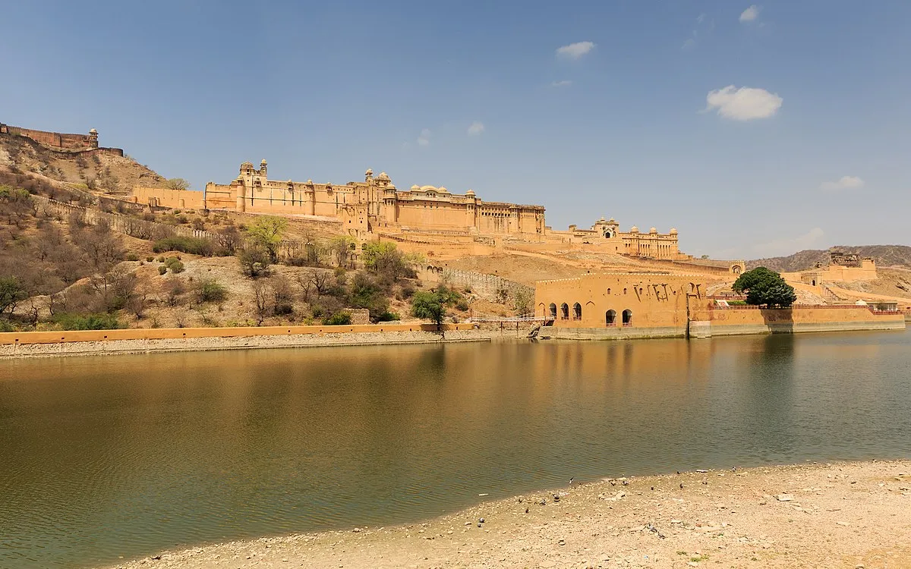
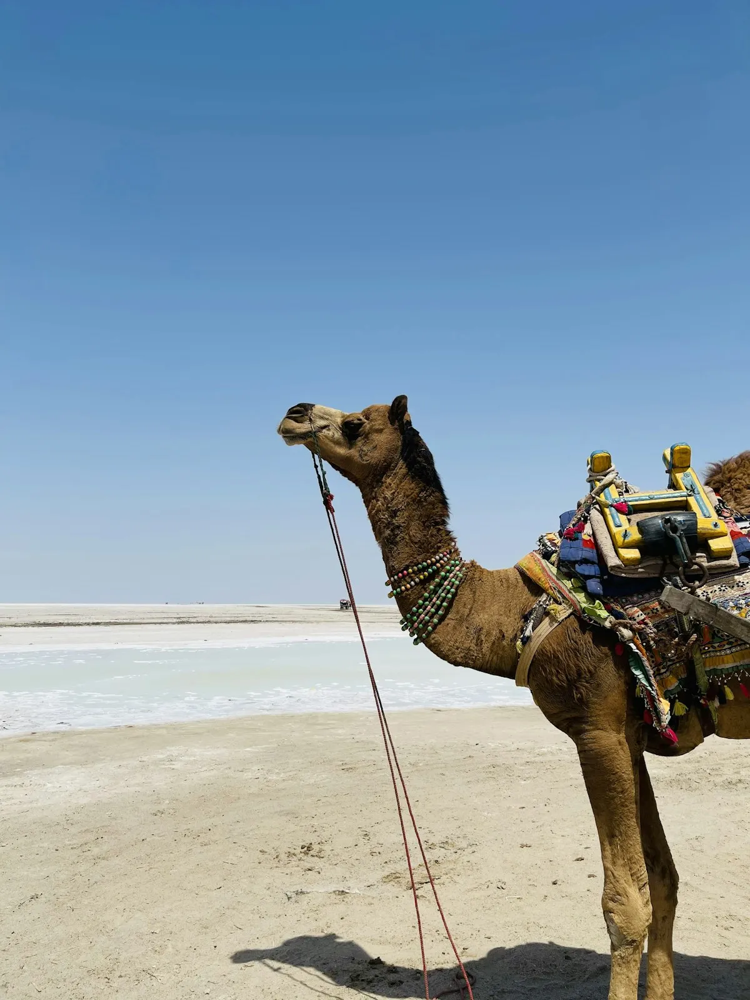
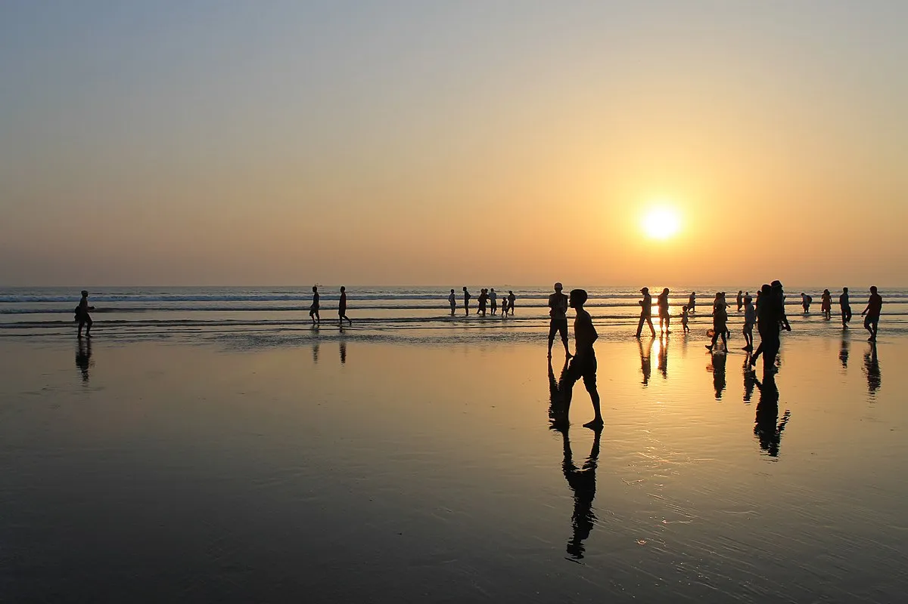

# Trip 02: Delhi to Chittagong

**September – December 2027 (111 days)**

**17,460 km driving | 3 countries | 240 hours driving time**

---

## Route Overview

**India (Grand Loop) → Nepal → Bangladesh → Chittagong**

```
Delhi → Agra → Jaipur → Jodhpur → Jaisalmer → Udaipur →
Rann of Kutch → Ahmedabad → Mumbai → Goa → Hampi → Bangalore →
Kochi → Munnar → Kerala Backwaters → Madurai → Chennai →
Visakhapatnam → Kolkata → Varanasi

[NEPAL]
Kathmandu → Bhaktapur → Nagarkot → Pokhara → Lumbini → Chitwan

[BANGLADESH]
Paharpur → Dhaka → Sundarbans → Cox's Bazar → Chittagong

[SHIP: Chittagong → Laem Chabang - 14 days]
```

---

# Detailed Itinerary

## Week 1: Golden Triangle & Rajasthan Start

### Day 1: Delhi
**Pick up vehicle, Golden Triangle begins**

| | |
|---|---|
| **Driving** | 0 km |
| **Stay** | Hotel - Delhi |

- Pick up car from storage
- Vehicle inspection after 3-month break
- Evening: Prepare for early start

---

### Day 2: Delhi → Agra
**Taj Mahal**


| | |
|---|---|
| **Distance** | 207 km |
| **Driving** | 3 hrs |
| **Stay** | Hotel - Agra (2 nights) |

- Yamuna Expressway to Agra
- Afternoon: Taj Mahal sunset viewing
- Evening: Rooftop dinner with Taj views

---

### Day 3: Agra
**Rest day - Mughal heritage**

| | |
|---|---|
| **Driving** | 0 km |
| **Stay** | Hotel - Agra |

- Sunrise: Taj Mahal (arrive 5:30am!)
- Agra Fort
- Baby Taj (Itimad-ud-Daulah)
- Evening: Mehtab Bagh river view

---

### Day 4: Agra → Jaipur
**Pink City**


| | |
|---|---|
| **Distance** | 246 km |
| **Driving** | 4 hrs |
| **Stay** | Hotel - Jaipur (2 nights) |

- Stop: Fatehpur Sikri (Mughal ghost city)
- Afternoon: Arrive Jaipur
- Evening: Hawa Mahal (Palace of Winds) lit up

---

### Day 5: Jaipur
**Rest day - Pink City exploration**



| | |
|---|---|
| **Driving** | Day trip to Amber Fort |
| **Stay** | Hotel - Jaipur |

- Morning: Amber Fort (arrive early, beat heat)
- City Palace, Jantar Mantar observatory
- Evening: Bazaar shopping, rooftop dinner

---

### Day 6: Jaipur → Jodhpur
**Blue City**


| | |
|---|---|
| **Distance** | 333 km |
| **Driving** | 5 hrs |
| **Stay** | Hotel - Jodhpur (2 nights) |

- Drive through Rajasthan countryside
- Afternoon: Mehrangarh Fort (best fort in India!)
- Evening: Blue city views at sunset

---

### Day 7: Jodhpur
**Rest day**

| | |
|---|---|
| **Driving** | 0 km |
| **Stay** | Hotel - Jodhpur |

- Mehrangarh Fort museum
- Jaswant Thada marble memorial
- Old city walk through blue streets
- Evening: Clock tower market

---

## Week 2: Desert & Lakes

### Day 8: Jodhpur → Jaisalmer
**Golden City**


| | |
|---|---|
| **Distance** | 279 km |
| **Driving** | 4 hrs |
| **Stay** | Hotel inside Fort - Jaisalmer (2 nights) |

- Desert drive, getting remote
- Afternoon: Arrive Jaisalmer - only "living fort" in India
- Stay inside 850-year-old fort walls

---

### Day 9: Jaisalmer
**Rest day - Desert experience**

| | |
|---|---|
| **Driving** | Desert excursion |
| **Stay** | Desert camp / Return to fort hotel |

- Morning: Fort exploration, havelis
- Afternoon: Camel safari into Sam Sand Dunes
- Sunset: Desert dunes, traditional dinner
- Option: Night in desert camp or return to fort

---

### Day 10: Jaisalmer → Udaipur
**City of Lakes**


| | |
|---|---|
| **Distance** | 531 km |
| **Driving** | 7 hrs |
| **Stay** | Hotel - Udaipur (2 nights) |

- Long drive through Rajasthan
- Stop: Ranakpur Jain temples (incredible carvings)
- Evening: Lake Pichola sunset

---

### Day 11: Udaipur
**Rest day - Venice of the East**

| | |
|---|---|
| **Driving** | 0 km |
| **Stay** | Hotel - Udaipur |

- City Palace
- Boat ride to Jag Mandir island
- Bagore Ki Haveli evening show
- Romantic lakeside dinner

---

### Day 12: Udaipur → Rann of Kutch
**Salt desert**



| | |
|---|---|
| **Distance** | 540 km |
| **Driving** | 8 hrs |
| **Stay** | Tent resort - Rann of Kutch |

- Cross into Gujarat
- Arrive evening at white salt desert
- Sunset over endless white expanse

---

### Day 13: Rann of Kutch
**Rest day - White desert**

| | |
|---|---|
| **Driving** | Local exploration |
| **Stay** | Tent resort - Rann of Kutch |

- Sunrise on salt flats (stunning!)
- Visit local Kutchi villages
- Full moon nights: desert glows white
- Evening: Cultural program

---

### Day 14: Rann of Kutch → Ahmedabad
**Gujarat capital**

| | |
|---|---|
| **Distance** | 396 km |
| **Driving** | 6 hrs |
| **Stay** | Hotel - Ahmedabad |

- Drive across Gujarat
- Evening: Sabarmati Ashram (Gandhi's home)
- Old city pol houses, Adalaj stepwell

---

## Week 3: West Coast

### Day 15: Ahmedabad → Mumbai
**Maximum city**

| | |
|---|---|
| **Distance** | 522 km |
| **Driving** | 7 hrs |
| **Stay** | Hotel - Mumbai (2 nights) |

- Drive south on expressway
- Afternoon: Gateway of India
- Evening: Marine Drive, Colaba buzz

---

### Day 16: Mumbai
**Rest day**

| | |
|---|---|
| **Driving** | 0 km |
| **Stay** | Hotel - Mumbai |

- Elephanta Caves (ferry trip)
- Dhobi Ghat laundry
- Crawford Market, street food
- Evening: Bandra, Juhu Beach

---

### Day 17: Mumbai → Goa
**Beach paradise**

| | |
|---|---|
| **Distance** | 537 km |
| **Driving** | 8 hrs |
| **Stay** | Beach resort - North Goa (3 nights) |

- Coastal highway south
- Konkan coast scenery
- Evening: Baga Beach sunset

---

### Day 18-19: Goa
**Rest days - Beach life**

| | |
|---|---|
| **Driving** | Beach hopping only |
| **Stay** | Beach resort - North Goa |

- Anjuna flea market
- Old Goa churches (UNESCO)
- Palolem Beach (south Goa day trip)
- Seafood, sunsets, relaxation

---

### Day 20: Goa → Hampi
**UNESCO boulder landscape**


| | |
|---|---|
| **Distance** | 358 km |
| **Driving** | 6 hrs |
| **Stay** | Guesthouse - Hampi (2 nights) |

- Drive inland through Karnataka
- Afternoon: Arrive Hampi
- Sunset: Virupaksha Temple, boulder views

---

### Day 21: Hampi
**Rest day - Ancient Vijayanagara**

| | |
|---|---|
| **Driving** | 0 km |
| **Stay** | Guesthouse - Hampi |

- Vittala Temple, stone chariot
- Royal enclosure
- Cliff jumping at Sanapur Lake
- Sunset: Matanga Hill (epic views)

---

## Week 4: South India

### Day 22: Hampi → Bangalore
**Tech capital**

| | |
|---|---|
| **Distance** | 339 km |
| **Driving** | 5 hrs |
| **Stay** | Hotel - Bangalore |

- Drive through Karnataka
- Afternoon: Bangalore Palace
- Evening: MG Road, craft beer scene

---

### Day 23: Bangalore → Kochi
**Kerala spice coast**

| | |
|---|---|
| **Distance** | 512 km |
| **Driving** | 8 hrs |
| **Stay** | Heritage hotel - Fort Kochi (2 nights) |

- Long drive through Western Ghats
- Evening: Fort Kochi colonial area
- Chinese fishing nets at sunset

---

### Day 24: Kochi
**Rest day - Colonial heritage**

| | |
|---|---|
| **Driving** | 0 km |
| **Stay** | Heritage hotel - Fort Kochi |

- Jewish Synagogue, spice markets
- Dutch Palace
- Kathakali dance show
- Seafood on the waterfront

---

### Day 25: Kochi → Munnar
**Tea country**

| | |
|---|---|
| **Distance** | 126 km |
| **Driving** | 3.5 hrs |
| **Stay** | Resort - Munnar (2 nights) |

- Wind through mountains to hill station
- Endless tea plantations
- Cool temperatures, misty mornings

---

### Day 26: Munnar
**Rest day - Hill station**

| | |
|---|---|
| **Driving** | 0 km |
| **Stay** | Resort - Munnar |

- Tea factory visit
- Eravikulam National Park (Nilgiri tahr)
- Echo Point, Top Station
- Evening: Tea tasting

---

### Day 27: Munnar → Alleppey
**Kerala backwaters**


| | |
|---|---|
| **Distance** | 155 km |
| **Driving** | 4 hrs |
| **Stay** | Houseboat - Backwaters |

- Descend from hills to coast
- Board traditional kettuvallam houseboat
- Float through palm-lined canals
- Overnight on the water

---

### Day 28: Alleppey → Madurai
**Temple city**

| | |
|---|---|
| **Distance** | 279 km |
| **Driving** | 5.5 hrs |
| **Stay** | Hotel - Madurai (2 nights) |

- Morning: Backwaters continue
- Midday: Depart by road
- Evening: Meenakshi Temple first glimpse

---

## Week 5: Tamil Nadu & East Coast

### Day 29: Madurai
**Rest day - Dravidian wonders**

| | |
|---|---|
| **Driving** | 0 km |
| **Stay** | Hotel - Madurai |

- Meenakshi Amman Temple (stunning!)
- Thirumalai Nayakkar Palace
- Evening: Temple ceremony
- Banana leaf thali dinner

---

### Day 30: Madurai → Pondicherry
**French India**

| | |
|---|---|
| **Distance** | 327 km |
| **Driving** | 5.5 hrs |
| **Stay** | Boutique hotel - Pondicherry |

- Drive to former French colony
- Afternoon: French Quarter walking
- Evening: Promenade Beach, French cuisine

---

### Day 31: Pondicherry → Chennai
**South Indian metropolis**

| | |
|---|---|
| **Distance** | 166 km |
| **Driving** | 3 hrs |
| **Stay** | Hotel - Chennai |

- Morning: Auroville visit (utopian community)
- Drive to Chennai
- Evening: Marina Beach (world's 2nd longest urban beach)

---

### Day 32: Chennai → Visakhapatnam
**Along the Bay of Bengal**

| | |
|---|---|
| **Distance** | 795 km |
| **Driving** | Split over 2 days |
| **Stay** | Day 32: Nellore or Vijayawada |

- East Coast Highway
- Stop: Mahabalipuram shore temples
- Overnight: Midway stop

---

### Day 33: Continue → Visakhapatnam
**Vizag beaches**

| | |
|---|---|
| **Distance** | Continue from midway |
| **Stay** | Hotel - Visakhapatnam |

- Complete east coast drive
- Evening: RK Beach, submarine museum
- Seafood dinner

---

### Day 34: Visakhapatnam → Kolkata
**City of Joy**

| | |
|---|---|
| **Distance** | 882 km |
| **Driving** | Split over 2 days |
| **Stay** | Day 34: Bhubaneswar |

- Through Odisha
- Stop: Konark Sun Temple (UNESCO)
- Overnight: Bhubaneswar

---

### Day 35: Continue → Kolkata

| | |
|---|---|
| **Distance** | Continue from Bhubaneswar |
| **Stay** | Hotel - Kolkata (2 nights) |

- Morning: Bhubaneswar temples
- Complete drive to Kolkata
- Evening: Howrah Bridge at night

---

## Week 6: Bengal & Varanasi

### Day 36: Kolkata
**Rest day - British India legacy**

| | |
|---|---|
| **Driving** | 0 km |
| **Stay** | Hotel - Kolkata |

- Victoria Memorial
- Mother Teresa's Missionaries of Charity
- College Street book market
- Park Street dining

---

### Day 37: Kolkata → Varanasi
**Spiritual heart of India**


| | |
|---|---|
| **Distance** | 697 km |
| **Driving** | 10 hrs |
| **Stay** | Ghat hotel - Varanasi (3 nights) |

- Long drive west
- Evening: First glimpse of the Ganges
- Night aarti ceremony at Dashashwamedh Ghat

---

### Day 38-39: Varanasi
**Rest days - Sacred city**

| | |
|---|---|
| **Driving** | 0 km |
| **Stay** | Ghat hotel - Varanasi |

- Sunrise boat ride on Ganges (essential!)
- Ghat walking tour
- Sarnath (where Buddha first taught)
- Silk weaving workshops
- Dawn and dusk ceremonies

---

### Day 40: Varanasi → Kathmandu
**Enter Nepal**

| | |
|---|---|
| **Distance** | 517 km |
| **Driving** | 10 hrs |
| **Border** | India → Nepal (Sunauli/Bhairahawa) |
| **Stay** | Hotel - Kathmandu |

- Early start, long driving day
- Border crossing midday
- Evening: Arrive Kathmandu
- Thamel buzz

---

## Week 7: Nepal

### Day 41: Kathmandu
**Rest day - Capital exploration**


| | |
|---|---|
| **Driving** | 0 km |
| **Stay** | Hotel - Kathmandu |

- Durbar Square (damaged but impressive)
- Swayambhunath (Monkey Temple) sunrise
- Boudhanath Stupa (largest in Nepal)
- Pashupatinath Temple

---

### Day 42: Kathmandu → Bhaktapur
**Medieval city**

| | |
|---|---|
| **Distance** | 15 km |
| **Driving** | 30 min |
| **Stay** | Heritage hotel - Bhaktapur |

- Short drive to Bhaktapur
- Best preserved medieval city in Nepal
- Durbar Square, Nyatapola Temple
- Potter's Square, traditional crafts

---

### Day 43: Bhaktapur → Nagarkot
**Himalayan viewpoint**

| | |
|---|---|
| **Distance** | 18 km |
| **Driving** | 45 min |
| **Stay** | Resort - Nagarkot |

- Drive up to ridge
- Everest visible on clear days!
- Sunset over Himalayan range
- Peaceful hill station atmosphere

---

### Day 44: Nagarkot → Pokhara
**Adventure capital**

| | |
|---|---|
| **Distance** | 227 km |
| **Driving** | 6 hrs |
| **Stay** | Lakeside hotel - Pokhara (3 nights) |

- Morning: Sunrise over mountains
- Drive across Nepal
- Afternoon: Phewa Lake arrival
- Annapurna views from lakeside

---

### Day 45-46: Pokhara
**Rest days - Lake & mountains**

| | |
|---|---|
| **Driving** | 0 km |
| **Stay** | Lakeside hotel - Pokhara |

- Sarangkot sunrise (Annapurna panorama)
- World Peace Pagoda hike
- Devi's Falls, Gupteshwor Cave
- Paragliding option
- Lake boating, mountain views

---

### Day 47: Pokhara → Lumbini
**Buddha's birthplace**

| | |
|---|---|
| **Distance** | 199 km |
| **Driving** | 4 hrs |
| **Stay** | Hotel - Lumbini |

- Drive to Terai plains
- UNESCO site: Buddha born here 623 BC
- Maya Devi Temple
- International monasteries

---

## Week 8: Chitwan & Bangladesh

### Day 48-49: Lumbini → Chitwan
**Jungle safari**

| | |
|---|---|
| **Distance** | 184 km |
| **Driving** | 3.5 hrs |
| **Stay** | Jungle lodge - Chitwan (2 nights) |

- Morning: Lumbini gardens
- Drive to Chitwan National Park
- Jeep safari, elephant encounters
- One-horned rhino spotting
- Canoe trip, bird watching

---

### Day 50: Chitwan → Paharpur
**Into Bangladesh**

| | |
|---|---|
| **Distance** | 716 km |
| **Driving** | 12 hrs (split recommended) |
| **Border** | Nepal → India → Bangladesh |
| **Stay** | Guesthouse near Paharpur |

- Very long day (consider splitting)
- Cross India briefly
- Enter Bangladesh
- Arrive Paharpur late

---

### Day 51: Paharpur
**Buddhist heritage**

| | |
|---|---|
| **Distance** | 0 km |
| **Stay** | Guesthouse near Paharpur |

- Somapura Mahavihara (UNESCO)
- 8th century Buddhist monastery
- Largest south of Himalayas
- Archaeological museum

---

### Day 52: Paharpur → Dhaka
**Bangladesh capital**

| | |
|---|---|
| **Distance** | 257 km |
| **Driving** | 5 hrs |
| **Stay** | Hotel - Dhaka (2 nights) |

- Drive to chaotic Dhaka
- Afternoon: Old Dhaka exploration
- Evening: Pink Palace (Ahsan Manzil)

---

### Day 53: Dhaka
**Rest day - Megacity**

| | |
|---|---|
| **Driving** | 0 km |
| **Stay** | Hotel - Dhaka |

- Lalbagh Fort
- Star Mosque
- Sadarghat river terminal (incredible!)
- National Parliament Building

---

## Week 9: Sundarbans & Coast

### Day 54-55: Dhaka → Sundarbans
**Tiger mangroves**


| | |
|---|---|
| **Distance** | 315 km to Khulna |
| **Driving** | 6 hrs |
| **Stay** | Boat/lodge - Sundarbans (2 nights) |

- Drive to Khulna, board boat
- Enter Sundarbans mangrove forest
- World's largest mangrove, Bengal tigers
- Boat cruises through channels
- Spotted deer, crocodiles, monkeys

---

### Day 56: Sundarbans → Khulna

| | |
|---|---|
| **Distance** | 136 km |
| **Driving** | 2.5 hrs |
| **Stay** | Hotel - Khulna |

- Morning: Final Sundarbans exploration
- Return to Khulna
- Evening: Local market

---

### Day 57: Khulna → Dhaka
**Return north**

| | |
|---|---|
| **Distance** | 204 km |
| **Driving** | 4 hrs |
| **Stay** | Hotel - Dhaka |

- Drive back to Dhaka
- Afternoon: Any missed sights
- Prepare for coast journey

---

### Day 58: Dhaka → Cox's Bazar
**World's longest beach**



| | |
|---|---|
| **Distance** | 393 km |
| **Driving** | 7 hrs |
| **Stay** | Beach resort - Cox's Bazar (2 nights) |

- Long drive southeast
- Arrive at 120 km unbroken sandy beach
- Evening: Beach sunset

---

### Day 59: Cox's Bazar
**Rest day - Beach**

| | |
|---|---|
| **Driving** | Local excursions |
| **Stay** | Beach resort - Cox's Bazar |

- Laboni Beach
- Himchari waterfall
- Inani Beach (quieter, golden sand)
- Seafood dinner

---

### Day 60: Cox's Bazar → Chittagong
**Port city & shipping**

| | |
|---|---|
| **Distance** | 141 km |
| **Driving** | 2.5 hrs |
| **Stay** | Hotel - Chittagong |

- Morning: Final beach time
- Drive to Chittagong
- Arrange vehicle shipping
- Ship breaks beach (unique sight)

---

## Week 10: Shipping & Departure

### Day 61-62: Chittagong
**Vehicle shipping**

| | |
|---|---|
| **Driving** | Port logistics |
| **Stay** | Hotel - Chittagong |

- Clear paperwork for shipping
- Car loaded onto ship to Thailand
- Explore Chittagong (Foy's Lake, Ethnological Museum)

---

### Day 63: Fly Home
**Chittagong → Dhaka → Singapore**

- Domestic flight to Dhaka
- International flight home
- Vehicle on ship to Laem Chabang

---

### Buffer: Days 64-70
**Contingency**

- Built-in buffer for delays
- Weather issues
- Visa complications
- Recovery time

---

# Summary Statistics

| Metric | Value |
|--------|-------|
| **Total Days** | 63 driving + 7 buffer = 70 core |
| **Countries** | 3 (India, Nepal, Bangladesh) |
| **Driving Distance** | 17,460 km |
| **Driving Time** | 240 hours |
| **Rest Days** | ~20 |
| **Border Crossings** | 3 |

## Highlights

1. **Taj Mahal** - World's most beautiful building
2. **Rajasthan forts** - Mehrangarh, Jaisalmer, Amber
3. **Rann of Kutch** - White salt desert
4. **Kerala Backwaters** - Houseboat through palm canals
5. **Varanasi** - India's spiritual heart
6. **Pokhara** - Annapurna panorama
7. **Chitwan** - One-horned rhinos
8. **Sundarbans** - Bengal tiger mangroves
9. **Cox's Bazar** - World's longest beach

---

## Driving Conditions

### India
- **Highways:** Major routes excellent (expressways)
- **Rural:** Variable, can be rough
- **Traffic:** Chaotic in cities
- **Tip:** Avoid night driving

### Nepal
- **Roads:** Generally poor outside Kathmandu
- **Mountains:** Narrow, landslide-prone
- **Tip:** 4WD essential, monsoon closes roads

### Bangladesh
- **Roads:** Improving, main highways OK
- **Traffic:** Extremely congested
- **Ferries:** Some river crossings required

---

## Weather

| Region | Sep-Oct | Nov-Dec |
|--------|---------|---------|
| North India | Post-monsoon, warm | Cool, perfect |
| South India | Warm, occasional rain | Pleasant |
| Nepal | Clear, best season | Cool, dry |
| Bangladesh | Hot, humid | Cooler, dry |

**Best timing:** September start catches perfect Nepal weather (Oct-Nov) and India cooling down (Nov-Dec).

---

## Budget Estimate

| Category | Cost |
|----------|------|
| Accommodation (70 nights) | $4,200 |
| Food | $2,500 |
| Fuel (17,460 km) | $1,050 |
| Shipping (Chittagong→Thailand) | $2,500 |
| Visas | $200 |
| Activities & entry fees | $1,000 |
| Houseboat Kerala | $300 |
| Chitwan safari | $400 |
| Sundarbans tour | $300 |
| Misc | $500 |
| **Total** | **~$12,950** |

---

## Connectivity

### Starlink
- **India:** Banned - do NOT bring
- **Nepal:** Not licensed
- **Bangladesh:** Not licensed

### Mobile Data
- Local SIMs work well everywhere
- Coverage good in cities
- Remote areas limited

### Blackout Periods
| Location | Days |
|----------|------|
| Sundarbans | 2-3 |
| Remote Nepal | 2-3 |

---

## End of Trip 2

**Store car:** Chittagong port → Ship to Laem Chabang, Thailand
**Fly home:** Dhaka → Singapore (via Bangkok or KL)

---

*Continue to Trip 3 (Thailand & Southeast Asia) for pickup in Laem Chabang*

---

*Last updated: January 2026*
